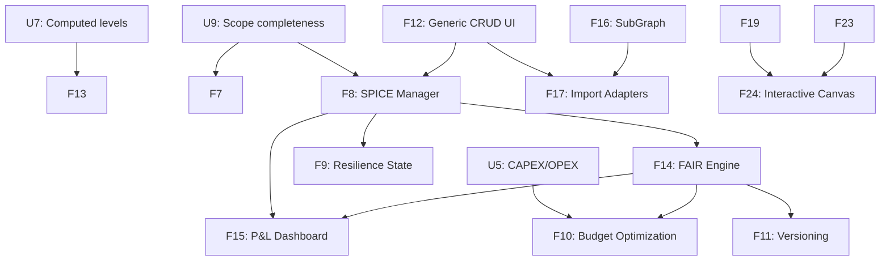

# Risk Influence Map (RIM) - Development Roadmap v2
**Optimized for Multi-Agent Execution**

**Context for Future AI Agents:**
This `ROADMAPv2.md` is a cleaned and restructured version of the original roadmap. It maintains the core architectural philosophy (Simplicity, Modularity, Strict Validation, Scope Completeness) but reorganizes planned features into **Parallel Work Streams**. 

Agents can be assigned to different streams simultaneously, allowing for rapid development without merge conflicts or stepping on each other's toes.

---

## Completed Phases (Reference Only)

*   **Phase 1: Foundation, Architecture & Scope Completeness**
    *   U1-U3, U6-U10, F1-F3 are **COMPLETE**. 
    *   The generic ContextNode architecture, computed levels, relationship semantics, scope completeness, and UI performance enhancements are established.

---

## Current Roadmap: Multi-Agent Parallel Execution

The following features have been broken down into independent work streams. **Multiple agents can work on streams A, B, and C in parallel.**

### 🌊 Work Stream A: Visual & UI Enhancements (Frontend Focused)
*Requires knowledge of Streamlit, PyVis, CSS, and UI/UX patterns. Can be developed without altering core database logic.*

*   ~~**[F4] One-Click Visualization Export**~~ ✅ _(v2.12.0)_: Export the active styled graph view to PNG or PDF directly from the PyVis canvas or Streamlit container.
*   ~~**[F13] Zone-Aware 4-Layer Visual Layout**~~ ✅ _(v2.13.0)_: Extend `ui/layouts.py` to position nodes across four visual bands: `[Lower Context Zone] → [Operational Risks] → [Business Risks] → [Upper Context Zone]`. Y-axis position within risk bands is determined by computed level (`U7`).
*   ~~**[F19] Interactive Focus Mode (Neighborhood Highlight)**~~ ✅ _(v2.14.0)_: When clicking a specific risk, mitigation, or TPO, automatically fade all nodes that are not connected to it to instantly highlight its root causes and consequences.
*   ~~**[F20] Exposure-Driven Opacity**~~ ✅ _(v2.15.0)_: Combine the exposure color gradient with opacity. Low-exposure or acceptable risks naturally fade into the background, while high-exposure critical risks remain 100% opaque.
*   ~~**[F21] Lifecycle & Status Ghosting**~~ ✅ _(v2.15.0)_: Use transparency as a metaphor for things that are "not fully realized yet" (e.g., Contingent Risks, or "Proposed" / "Deferred" mitigations appear at 50% opacity, while "Implemented" mitigations are fully solid).
*   ~~**[F25] Dashboard Simplification**~~ ✅ _(v2.20.0)_: Remove TPOs related information in the dashboard panel to reduce cognitive load.
*   ~~**[F26] Contextual Property Panel**~~ ✅ _(v2.21.0)_: Display the properties of the selected object in the graph within an appropriate zone below the graph. Includes dynamic properties (critical path status, mitigated state, relevant risk management info) structured for easy future modification.
*   ~~**[F27] Graph Canvas Search**~~ ✅ _(v2.20.0)_: Add a dedicated search text area for fast and direct graph node or edge selection in the graph UI.

### 🌊 Work Stream B: Schema & Context Data Management (Backend/Fullstack)
*Requires knowledge of the existing Pydantic/YAML schema loader, CRUD forms, and Streamlit session state.*

*   ~~**[U4] Strict Data Validation (Pydantic)**~~ ✅ _(v2.16.0)_: Implement rigid validation for all incoming graph logic using `pydantic`. Models must cover both risk nodes and generic context nodes, driven by schema YAML property definitions.
*   ~~**[U5] Mitigation Budget Attributes**~~ ✅ _(v2.16.0)_: Extend the Mitigation schema with **CAPEX** and **OPEX** attributes in the YAML and update the UI forms to capture them.
*   ~~**[U11] Risk Subtypes**~~ ✅ _(v2.11.0)_: Schema-driven subtype system with 9 built-in subtypes. Each subtype defines `applies_to` levels and optional `extension_fields` stored as `ext_*` properties on `:Risk` nodes. Zero impact on exposure engine.
*   ~~**[F12] Generic Context Node and Context Edge CRUD UI**~~ ✅ _(v2.17.0)_: A schema-driven UI to manage custom context nodes/edges exactly how risks/influences are managed. Driven entirely by property definitions in YAML. Must be scope-aware.
*   ~~**[F18] Extend Data Management for Context Data**~~ ✅ _(v2.18.0)_: Extend the existing Excel import/export and JSON backup/restore capabilities (`import_export.py`) to fully handle ContextNode and ContextEdge data.
*   ~~**[F22] Scope Node Management UI**~~ ✅ _(v2.19.0)_: Dedicated CRUD for Scopes allowing users to quickly add or suppress (remove) nodes within them.
*   ~~**[F23] Enhanced Node and Edge Editor**~~ ✅ _(v2.19.0)_: Improved CRUD specifically focused on seamlessly modifying existing nodes and edges across the application.
*   ~~**[F28] Advanced Scope Definition Filters**~~ ✅ _(v2.22.0)_: Implement an improved and user-friendly way to find and select nodes for scope definition, leveraging the dynamic filter system.
*   **[F29] Interactive Scope Sandbox** _(Iteration 3)_: Provide a mechanism to temporarily create or modify a scope by interacting directly with the graph during a risk analysis session.

### 🌊 Work Stream C: Analytical & Simulation Tools (Algorithmic)
*Requires deep understanding of the `exposure_calculator.py` engine, graph mathematics, and scope logic.*

*   **[F5] Automated Risk Threshold Alerts**: Visual flags in the UI when computed exposure exceeds predefined thresholds. Must be scope-aware.
*   **[F6] Mitigation Exposure View (Business Focus)**: Dedicated view showing mitigations contributing to exposure reduction for selected Business Risks, filterable by lifecycle status. Must be scope-aware.
*   **[F7] "What-If" Analysis Sandbox**: Toggle mitigations ON/OFF to live-preview downstream exposure changes without committing to the DB. **Critical Constraint**: Must operate fully within the active scope — Sandbox must never produce results including out-of-scope nodes.
*   ~~**[F30] Retroaction Loop Detection**~~ ✅ _(v2.20.0)_: Implement a check control to reliably detect any retroaction loops (cyclical dependencies) prior to running exposure calculations.
*   **[F31] Scope-Driven Simulation & Results Storage** _(Iteration 4)_: Update Simulation/Calibration pages to utilize the *current active scope* rather than randomly generated graphs. Introduce a storage system to record simulation results for future exploitation and comparison.

---

## 🗓️ Active Sprint Plan: Iterations for Next Development Cycle

The following 4 iterations address features F25–F31, grouped to minimize context-switching and inter-agent conflicts. Each iteration is a self-contained deliverable with a clear testing scope. **Git commits are performed by the user after each iteration is verified.**

---

### ✅ Iteration 1 — Foundation Safety & Quick UX Wins _(v2.20.0)_
**Target features:** F25, F30, F27
**Streams:** A (UI) + C (Algorithm) — no Stream B dependency, no merge conflicts
**Prerequisites:** None

| Task | File(s) | Details |
|------|---------|---------|
| **F25** Dashboard TPO removal | `ui/home.py` → `render_statistics_dashboard()` | Remove rows 2 metrics: `total_tpos`, `total_tpo_impacts`. Remove corresponding keys from `_compute_stats_from_graph()`. Remove TPO-specific columns from stats layout. |
| **F30** Retroaction loop detection | `services/exposure_calculator.py`, `ui/home.py` | Add `detect_cycles(influences) → List[List[str]]` function using DFS. Add `validate_graph_for_calculation() → ValidationResult` that returns cycle info. Call validation in `render_exposure_dashboard()` before calculation; surface a `st.warning` with cycle details if loops found. The exposure calc continues (with existing fallback) but the user is informed. |
| **F27** Graph canvas search | `ui/home.py` (visualization section) | Add a `st.text_input` search box above the graph. On input, filter the node list and highlight matching nodes (set `highlighted_node_id` and auto-select first match). Supports partial match on node name. Clear button resets selection. Wired to existing `selected_node_id` session state. |

**Testing scope:** Stats dashboard no longer shows TPO rows. Cycle warning appears when a cyclic graph is loaded. Search box selects and highlights matching nodes.

---

### ✅ Iteration 2 — Rich Contextual Property Panel (F26) _(v2.21.0)_
**Target features:** F26
**Streams:** A (UI) — reads from existing services, no DB writes
**Prerequisites:** Iteration 1 (F30 needed to surface cycle status in panel)

| Task | File(s) | Details |
|------|---------|---------|
| **F26** New `NodePropertyPanel` component | `ui/panels/node_property_panel.py` (new file) | Replace the bare `render_inline_editor` call below the graph with a structured panel. Sections (all collapsible, easily extendable): **① Identity** (name, level, subtype, description, origin, status), **② Exposure Metrics** (likelihood, impact, base/final exposure, residual %, mitigation factor — sourced from last `exposure_results`), **③ Graph Position** (computed level/BFS depth, upstream count, downstream count), **④ Influence Analysis** (is on critical path ✅/❌, is a bottleneck ✅/❌, convergence score, propagation score — sourced from last `influence_results` in session state), **⑤ Mitigation Summary** (count, lifecycle breakdown, effective coverage %), **⑥ Edit shortcut** (existing `render_inline_editor` call preserved inside this section). |
| Wire panel to graph | `ui/home.py` | Replace current `render_inline_editor(manager, selected_node_id)` call (line ~1031) with `render_node_property_panel(manager, selected_node_id, exposure_results, influence_results)`. Also wire search result selection (F27) through the same panel. |

**Design principle:** The panel is built as a list of `Section` dataclasses — each section has an `id`, `title`, `render_fn`. Future sections can be appended to this list with zero modification to existing sections.

**Testing scope:** Selecting any node via click, dropdown, or search shows the panel. All 6 sections render correctly. Panel updates when a new node is selected. Exposure and influence data shows "N/A" gracefully when not yet calculated.

---

### 🔁 Iteration 3 — Smart Scope Management (F28 + F29)
**Target features:** F28, F29
**Streams:** B (Schema/Data) + A (UI interaction)
**Prerequisites:** None (independent of Iterations 1–2)

| Task | File(s) | Details |
|------|---------|---------|
| ~~**F28**~~ ✅ _(v2.22.0)_ Advanced Scope Filter UI | `ui/panels/scope_filter_panel.py` (new), `ui/tabs/unified_crud_tab.py`, `pages/1_⚙️_Configuration.py` | In the Scope Definition view, add: **① Text search** field (filters node list by partial name match), **② Level filter** (Business / Operational multiselect), **③ Subtype filter** (schema-driven, multiselect), **④ Exposure range** slider (min/max final exposure — requires exposure results in session), **⑤ "Select All Filtered" / "Deselect All Filtered" bulk action buttons**. Results show as a filterable table with checkboxes. Also applied to Configuration page scope creation and edit sections. |
| **F29** Interactive Scope Sandbox | `ui/home.py` (graph section), `utils/state_manager.py` | Add a **"Scope Sandbox"** toggle in the sidebar (visible only when a scope is active). In sandbox mode: right-clicking a node in the graph shows an `st.popover`-style action (add to scope / remove from scope). Sandbox changes are stored in `session_state.scope_sandbox_overrides` (add/remove sets). A banner shows "🧪 Sandbox active — N additions, M removals". A "Commit to Scope" button persists sandbox changes to DB. A "Discard Sandbox" button reverts. Sandbox mode does NOT affect DB until committed. |

**Testing scope:** Scope definition filter narrows node list correctly. Bulk-select respects filtered results. Sandbox mode flag is visible only with active scope. Adding/removing nodes in sandbox updates the banner count. Commit persists correctly; discard reverts without DB change.

---

### 🔁 Iteration 4 — Simulation Grounding (F31)
**Target features:** F31
**Streams:** C (Algorithmic) — self-contained to `pages/2_🎲_Simulation.py`
**Prerequisites:** None (independent of Iterations 1–3)

| Task | File(s) | Details |
|------|---------|---------|
| **F31a** Scope-driven simulation mode | `pages/2_🎲_Simulation.py` | Add a new simulation mode: **"Scope-Based (Real Data)"** alongside the existing Random/Path modes. In this mode: connect to DB via session state credentials, load risks and influences for the active scope (or full graph if no scope), use real `likelihood`/`impact`/`strength` values, run the same mitigation variation logic on real node topology. Requires sidebar DB connection reuse (read from `st.session_state.manager` if available, else prompt). |
| **F31b** Simulation results storage | `pages/2_🎲_Simulation.py`, new `utils/simulation_store.py` | After any simulation run, offer **"💾 Save Results"** button. Saved results stored in `st.session_state.saved_simulations` as a list of `SimulationRecord` (timestamp, mode, params, key metrics, full DataFrame). A **"📊 Saved Results"** tab shows all saved runs in a comparison table (delta metrics vs. first saved run). Export all saved results as a single Excel file with one sheet per run. |

**Testing scope:** Scope-based mode loads real risks from DB. Simulation completes without error on demo dataset. Results can be saved, listed, and compared. Export produces valid Excel.

---

## Future Horizons (Requires Stream B & C Completion)

The following streams have hard dependencies on the streams above and should be tackled sequentially afterward.

### 🌊 Work Stream D: SPICE Scenarios & Financial Anchoring (Depends on B)
*   **[F8] SPICE Scenario Manager**: Full UI for ContextNode-based scenario create/edit/link.
*   **[F9] Resilience State Modeling**: Classify into Robust/Resilient/Fragile based on SPICE exposure vs thresholds.
*   **[F15] P&L Exposure Dashboard**: Aggregate EBIT-at-risk and FCF-at-risk per `business_perimeter` context node.

### 🌊 Work Stream E: FAIR Financials (Depends on D & C)
*   **[F14] FAIR Financial Quantification — SPICE-Calibrated**: ALE engine using TEF from SPICE, LM from SPICE impact ranges, Vulnerability from existing mitigation engine.
*   **[F10] Mitigation Budget Management**: CAPEX/OPEX-constrained optimization (Depends on U5) using FAIR ALE as the objective function.

### 🌊 Work Stream F: Advanced Architecture
*   **[F16] SubGraph Promotion and System of Systems**: Promote `AnalysisScopeConfig` to `SubGraphConfig` with hierarchy and policies.
*   **[F17] External Graph Ingestion (Import Adapters)**: YAML-defined adapters mapping external node/edge types to ContextNode types (e.g., IT architecture, Supply Chain).
*   **[F11] Historical Timeline / Versioning**: Render graph state "as it was" at any previous date.

### 🌊 Work Stream G: Advanced Graphical Interaction (BIG Features)
*   **[F24] Interactive Canvas Editing**: Graphically interact with the graph directly within the visualization. Includes drawing new nodes and edges, modifying existing elements right on the canvas, and advanced graphical analysis tooling.

## Open Questions — Multi-Agent Coordination

**Q1 — Cross-Stream Dependency Management**
When an agent in Stream A requires backend modifications (e.g., a new field added by Stream B) to complete a UI task, what is the protocol for pausing and handing over the task without causing a merge conflict or logic fragmentation?

**Q2 — Agent Testing Sandboxes**
Are there dedicated, isolated database instances or namespaces for agents to run the mandatory Testing Gateways without overwriting each other's test data during parallel execution?

**Q3 — Schema Context Limits**
As the YAML schema grows to accommodate multiple domains, how will AI agents maintain the full schema in their context window efficiently to ensure strict validation rules are followed without hitting LLM token limits?

**Q4 — Dynamic Tracking of Computational Node Types**
Currently, `BusinessRisk`, `OperationalRisk`, and `Mitigation` are hardcoded as the only node types carrying mathematical weight in exposure calculations. If future domain schemas require new computational node types, should the YAML schema be extended to include a `computational: true` flag to dynamically register them, rather than relying on hardcoded lists in the application code?

---

## Feature Dependency Map (Simplified for Agents)

