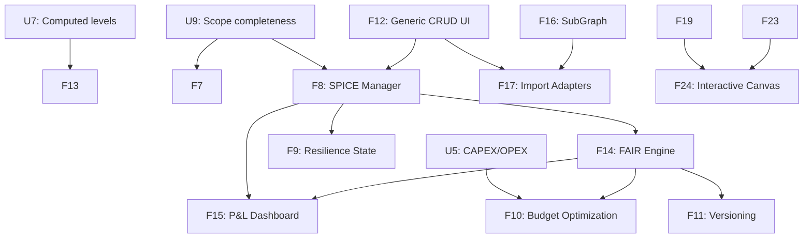

# Risk Influence Map (RIM) - Development Roadmap v2
**Optimized for Multi-Agent Execution**

**Context for Future AI Agents:**
This `ROADMAPv2.md` is a cleaned and restructured version of the original roadmap. It maintains the core architectural philosophy (Simplicity, Modularity, Strict Validation, Scope Completeness) but reorganizes planned features into **Parallel Work Streams**. 

Agents can be assigned to different streams simultaneously, allowing for rapid development without merge conflicts or stepping on each other's toes.

---

## Completed Phases (Reference Only)

*   **Phase 1: Foundation, Architecture & Scope Completeness**
    *   U1-U3, U6-U10, F1-F3 are **COMPLETE**. 
    *   The generic ContextNode architecture, computed levels, relationship semantics, scope completeness, and UI performance enhancements are established.

---

## Current Roadmap: Multi-Agent Parallel Execution

The following features have been broken down into independent work streams. **Multiple agents can work on streams A, B, and C in parallel.**

### 🌊 Work Stream A: Visual & UI Enhancements (Frontend Focused)
*Requires knowledge of Streamlit, PyVis, CSS, and UI/UX patterns. Can be developed without altering core database logic.*

*   ~~**[F4] One-Click Visualization Export**~~ ✅ _(v2.12.0)_: Export the active styled graph view to PNG or PDF directly from the PyVis canvas or Streamlit container.
*   ~~**[F13] Zone-Aware 4-Layer Visual Layout**~~ ✅ _(v2.13.0)_: Extend `ui/layouts.py` to position nodes across four visual bands: `[Lower Context Zone] → [Operational Risks] → [Business Risks] → [Upper Context Zone]`. Y-axis position within risk bands is determined by computed level (`U7`).
*   ~~**[F19] Interactive Focus Mode (Neighborhood Highlight)**~~ ✅ _(v2.14.0)_: When clicking a specific risk, mitigation, or TPO, automatically fade all nodes that are not connected to it to instantly highlight its root causes and consequences.
*   **[F20] Exposure-Driven Opacity**: Combine the exposure color gradient with opacity. Low-exposure or acceptable risks naturally fade into the background, while high-exposure critical risks remain 100% opaque.
*   **[F21] Lifecycle & Status Ghosting**: Use transparency as a metaphor for things that are "not fully realized yet" (e.g., Contingent Risks, or "Proposed" / "Deferred" mitigations appear at 50% opacity, while "Implemented" mitigations are fully solid).

### 🌊 Work Stream B: Schema & Context Data Management (Backend/Fullstack)
*Requires knowledge of the existing Pydantic/YAML schema loader, CRUD forms, and Streamlit session state.*

*   **[U4] Strict Data Validation (Pydantic)**: Implement rigid validation for all incoming graph logic using `pydantic`. Models must cover both risk nodes and generic context nodes, driven by schema YAML property definitions.
*   **[U5] Mitigation Budget Attributes**: Extend the Mitigation schema with **CAPEX** and **OPEX** attributes in the YAML and update the UI forms to capture them.
*   ~~**[U11] Risk Subtypes**~~ ✅ _(v2.11.0)_: Schema-driven subtype system with 9 built-in subtypes. Each subtype defines `applies_to` levels and optional `extension_fields` stored as `ext_*` properties on `:Risk` nodes. Zero impact on exposure engine.
*   **[F12] Generic Context Node and Context Edge CRUD UI**: A schema-driven UI to manage custom context nodes/edges exactly how risks/influences are managed. Driven entirely by property definitions in YAML. Must be scope-aware.
*   **[F18] Extend Data Management for Context Data**: Extend the existing Excel import/export and JSON backup/restore capabilities (`import_export.py`) to fully handle ContextNode and ContextEdge data.
*   **[F22] Scope Node Management UI**: Dedicated CRUD for Scopes allowing users to quickly add or suppress (remove) nodes within them.
*   **[F23] Enhanced Node and Edge Editor**: Improved CRUD specifically focused on seamlessly modifying existing nodes and edges across the application.
*   **[F22] Scope Node Management UI**: Dedicated CRUD for Scopes allowing users to quickly add or suppress (remove) nodes within them.
*   **[F23] Enhanced Node and Edge Editor**: Improved CRUD specifically focused on seamlessly modifying existing nodes and edges across the application.

### 🌊 Work Stream C: Analytical & Simulation Tools (Algorithmic)
*Requires deep understanding of the `exposure_calculator.py` engine, graph mathematics, and scope logic.*

*   **[F5] Automated Risk Threshold Alerts**: Visual flags in the UI when computed exposure exceeds predefined thresholds. Must be scope-aware.
*   **[F6] Mitigation Exposure View (Business Focus)**: Dedicated view showing mitigations contributing to exposure reduction for selected Business Risks, filterable by lifecycle status. Must be scope-aware.
*   **[F7] "What-If" Analysis Sandbox**: Toggle mitigations ON/OFF to live-preview downstream exposure changes without committing to the DB. **Critical Constraint**: Must operate fully within the active scope — Sandbox must never produce results including out-of-scope nodes.

---

## Future Horizons (Requires Stream B & C Completion)

The following streams have hard dependencies on the streams above and should be tackled sequentially afterward.

### 🌊 Work Stream D: SPICE Scenarios & Financial Anchoring (Depends on B)
*   **[F8] SPICE Scenario Manager**: Full UI for ContextNode-based scenario create/edit/link.
*   **[F9] Resilience State Modeling**: Classify into Robust/Resilient/Fragile based on SPICE exposure vs thresholds.
*   **[F15] P&L Exposure Dashboard**: Aggregate EBIT-at-risk and FCF-at-risk per `business_perimeter` context node.

### 🌊 Work Stream E: FAIR Financials (Depends on D & C)
*   **[F14] FAIR Financial Quantification — SPICE-Calibrated**: ALE engine using TEF from SPICE, LM from SPICE impact ranges, Vulnerability from existing mitigation engine.
*   **[F10] Mitigation Budget Management**: CAPEX/OPEX-constrained optimization (Depends on U5) using FAIR ALE as the objective function.

### 🌊 Work Stream F: Advanced Architecture
*   **[F16] SubGraph Promotion and System of Systems**: Promote `AnalysisScopeConfig` to `SubGraphConfig` with hierarchy and policies.
*   **[F17] External Graph Ingestion (Import Adapters)**: YAML-defined adapters mapping external node/edge types to ContextNode types (e.g., IT architecture, Supply Chain).
*   **[F11] Historical Timeline / Versioning**: Render graph state "as it was" at any previous date.

### 🌊 Work Stream G: Advanced Graphical Interaction (BIG Features)
*   **[F24] Interactive Canvas Editing**: Graphically interact with the graph directly within the visualization. Includes drawing new nodes and edges, modifying existing elements right on the canvas, and advanced graphical analysis tooling.

## Open Questions — Multi-Agent Coordination

**Q1 — Cross-Stream Dependency Management**
When an agent in Stream A requires backend modifications (e.g., a new field added by Stream B) to complete a UI task, what is the protocol for pausing and handing over the task without causing a merge conflict or logic fragmentation?

**Q2 — Agent Testing Sandboxes**
Are there dedicated, isolated database instances or namespaces for agents to run the mandatory Testing Gateways without overwriting each other's test data during parallel execution?

**Q3 — Schema Context Limits**
As the YAML schema grows to accommodate multiple domains, how will AI agents maintain the full schema in their context window efficiently to ensure strict validation rules are followed without hitting LLM token limits?

**Q4 — Dynamic Tracking of Computational Node Types**
Currently, `BusinessRisk`, `OperationalRisk`, and `Mitigation` are hardcoded as the only node types carrying mathematical weight in exposure calculations. If future domain schemas require new computational node types, should the YAML schema be extended to include a `computational: true` flag to dynamically register them, rather than relying on hardcoded lists in the application code?

---

## Feature Dependency Map (Simplified for Agents)

