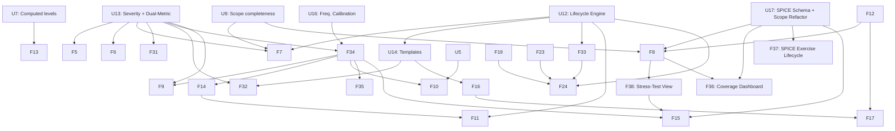

# Risk Influence Map (RIM) — Development Roadmap v3

**Optimised for Multi-Agent Execution**

**Context for Future AI Agents:**
This `ROADMAPv3.md` supersedes `ROADMAPv2.md`. It incorporates **five** architectural pillars decided following methodology reviews in March 2026:

1. **Risk Lifecycle Management** — 6-state lifecycle with trigger-based activation
2. **Dual-Metric Exposure Model** — Expected Loss (EL) + Tail Risk Indicator (TRI) + quadrant classification
3. **Generic Risk Template architecture** — template/instance pattern for combinatorial risk domains
4. **Severity-Based Exposure + Compound Loss Distribution** — `impact` renamed to `severity` as an intrinsic node property; graph exposure decoupled from financial magnitude; compound Poisson loss model producing a Loss Exceedance Curve (LEC) with ALE as a derived summary statistic. **Pillar 4 also formalises the time dimension of Likelihood through a dual-property model (`likelihood` score 1–10 + `annual_probability` decimal) anchored to a domain-configurable lookup table mapping each score to an annual Poisson rate λ and a return period. Frequency is always graph-derived — SPICE does not feed the LEC.**
5. **SPICE Integration Architecture** — dual-perimeter graph model (BusinessPerimeter + TechnicalPerimeter as first-class nodes); SPICE scenarios as concrete instantiations of Business Risks via `ILLUSTRATES` relationship; multi-axis scope selection (objective / financial / responsibility / technical); dual ownership model (Risk Steward via `STEWARDS` edge, Risk Bearer via `BEARS` edge); SPICE coverage analysis across business lines and the full enterprise.

These are **mandatory** components. They affect the exposure calculator, schema YAML, Neo4j data model, and multiple UI surfaces. Agents must read this document fully before beginning work on any Phase 2 or later feature.

---

## Completed Phases (Reference Only)

- **Phase 1: Foundation, Architecture & Scope Completeness** — **COMPLETE** (v2.23.0)
  - U1–U3, U6–U11, F1–F3, F12–F13, F18–F29, F30 are complete.
  - Generic ContextNode architecture, computed levels, relationship semantics, scope completeness, schema-driven filter system, zone-aware layout, interactive scope sandbox, node property panel, loop detection established.

---

## Architectural Pillars Added in v3

### Pillar 1 — Risk Lifecycle Management

**Motivation:** As programmes scale, the analysis canvas becomes unmanageable. Target: ~100 active nodes on canvas at any time. All lifecycle states are preserved in Neo4j for audit and re-activation.

| Status       | Definition                        | Canvas Visibility         | Exposure Calculated |
| ------------ | --------------------------------- | ------------------------- | ------------------- |
| `active`     | Currently tracked                 | Full opacity              | Yes                 |
| `accepted`   | Formal owner decision             | Hidden by default         | No                  |
| `watching`   | Accepted + monitoring condition   | Low opacity ghost         | No                  |
| `suppressed` | Exposure dropped below threshold  | Very low opacity          | No                  |
| `closed`     | Risk condition no longer exists   | Hidden (audit only)       | No                  |
| `archived`   | Terminal state; retention elapsed | Excluded from all queries | No                  |

**Trigger conditions:** string property `trigger_condition` on `accepted`/`watching` nodes, evaluated by `TriggerEngine` after each exposure run. Fires: `watching` → `active`, `suppressed` → `active`.

**Auto-acceptance:** defined in schema YAML. Blocked for any risk with `severity >= severity_ceiling` (default 7/10) regardless of final exposure. Protects black swans.

**Archiving:** risks in `accepted`/`closed` for > `archive_retention_days` (default 180) with no trigger fires and no linked open mitigations → dashboard alert → archived on explicit user confirmation.

---

### Pillar 2 — Dual-Metric Exposure Model

**Motivation:** `L × S` produces identical scores for (L=0.8, S=2) and (L=0.2, S=8). Different management responses required.

| Metric                        | Formula                                   | Purpose                                    |
| ----------------------------- | ----------------------------------------- | ------------------------------------------ |
| **Expected Loss (EL)**        | `Base_Exposure × Effective_Factor`        | Budgeting, operational prioritisation      |
| **Tail Risk Indicator (TRI)** | `Likelihood × Severity^α` (default α=1.5) | Surfaces severity risks disproportionately |

**Risk Quadrant Classification (computed, not stored in Neo4j):**

| Quadrant    | Condition             | Auto-Accept | Posture                          |
| ----------- | --------------------- | ----------- | -------------------------------- |
| `frequency` | L ≥ 6/10 AND S < 6/10 | Eligible    | Manage routinely                 |
| `severity`  | L < 6/10 AND S ≥ 7/10 | **Blocked** | Explicit human decision required |
| `critical`  | L ≥ 6/10 AND S ≥ 6/10 | **Blocked** | Priority mitigation              |
| `marginal`  | L < 6/10 AND S < 6/10 | Eligible    | Monitor or accept                |

All thresholds configurable per domain in schema YAML under `risk_lifecycle_rules.quadrant_thresholds`.

---

### Pillar 3 — Generic Risk Template Architecture

**Motivation:** Combinatorial risk spaces (e.g. cybersecurity entry_point × technical_target) generate graph explosion. Template/instance pattern contains complexity while preserving full analytical coverage.

- **`GenericRisk`** (`is_template: true`): risk class definition with baseline L and S. Excluded from all exposure calculations and canvas display by default.
- **`SpecificRisk`**: contextual instantiation linked via `[:INSTANTIATES]`. Only specific instances participate in the exposure engine.
- Templates are never subject to lifecycle transitions. They persist indefinitely.

---

### Pillar 4 — Severity-Based Exposure and Compound Loss Distribution

**Semantic correction — the rename:**
The property `impact` was a conflation of two distinct concepts: the intrinsic intensity of a risk event, and the financial consequence it produces. These require different models. `impact` is renamed to `severity` on **all** risk node types (both OperationalRisk and BusinessRisk).

- `severity` (1–10): intrinsic intensity of the risk event itself. Example: compromised admin account (S=8) > compromised user account (S=5), independently of which business objective is threatened.
- This is a **property-level rename only**. The formula `Base_Exposure = Likelihood × Severity` is structurally identical to the previous `L × I`. The propagation engine, mitigation degradation, and influence limitation logic are **unchanged**.
- Mitigations reduce **exposure** (the `L × S` graph score). They do **not** reduce financial magnitude. Magnitude reduction is modelled at the SPICE/financial layer through scenario adjustments — see Pillar 5.

**Two-tier architecture:**

_Tier 1 — Graph Exposure Layer:_
Inputs: `Likelihood` and `Severity` per risk node. Process: five-step propagation pipeline (unchanged). Output: `final_exposure` (EL, dimensionless 0–100), `TRI`, `risk_quadrant`. No financial units at this layer.

_Tier 2 — Financial Quantification Layer:_

- **Frequency input:** Business Risk `final_exposure` → mapped to Poisson event rate λ via piecewise linear calibration function. Frequency is derived from the graph layer only — from analyst direct entry of `annual_probability` on the Risk node, or from the lookup table fallback. SPICE scenarios do not feed the frequency input.
- **Magnitude input:** domain-configured parametric loss distribution (lognormal default; GPD for heavy-tail domains). Parameters are set by the analyst or domain administrator in schema YAML — they are not derived from SPICE estimates. SPICE produces stress-test trajectories (EBIT/FCF by year), not statistical distribution parameters.
- **Process:** compound Poisson Monte Carlo convolution (reusing existing Monte Carlo engine).
- **Output:** aggregate annual loss distribution → **Loss Exceedance Curve (LEC)** → ALE as derived summary statistic.

**Why LEC as primary output (not ALE alone):**
ALE = λ × Mean Magnitude collapses the distribution, masking tail behaviour. The LEC (`P(Annual Loss > x)`) is the standard output of catastrophe risk models in reinsurance, Basel operational risk, and cyber insurance. It naturally captures both EL (area under curve) and tail exposure (far-right portion). The Resilience State thresholds are redefined as exceedance probability thresholds on the LEC — more rigorous than absolute exposure numbers.

**Business Risk severity and the LEC:** the `severity` score always drives graph propagation to TPOs. The LEC is derived from graph-layer frequency (lookup table or analyst entry) and domain-configured magnitude parameters. SPICE scenarios are displayed alongside the LEC in the Node Property Panel as a complementary financial stress-test view — they do not modify the LEC calculation.

**The time dimension of Likelihood — dual-property model:**

Raw likelihood scores (1–10) are dimensionless ordinal values. The compound loss model requires λ in events/year. To bridge this gap without modifying the graph exposure engine, a dual-property model is adopted:

- `likelihood` (integer 1–10): **unchanged**. Used for graph exposure (L × S), TRI, quadrant classification, and visual display. No change to any existing logic.
- `annual_probability` (decimal, optional): the annual Poisson rate λ in events/year. Populated by one of two mechanisms, evaluated in priority order:
  1. **Analyst direct entry** (highest priority): analysts who can express frequency precisely (e.g. "3 events in 15 years → λ = 0.20") enter `annual_probability` directly on the Risk node.
  2. **Lookup table derivation** (fallback): the domain schema YAML defines a `likelihood_to_lambda` table mapping each score to a central λ and a return period. When `annual_probability` is not directly set, the calibrator reads the central λ from this table.

**Default lookup table (configurable per domain in schema YAML):**

| Score | Label        | Annual probability range | Central λ | Return period     |
| ----- | ------------ | ------------------------ | --------- | ----------------- |
| 1     | Exceptional  | < 0.5%                   | 0.003     | ~1 in 300 years   |
| 2     | Very rare    | 0.5%–1%                  | 0.008     | ~1 in 130 years   |
| 3     | Rare         | 1%–2%                    | 0.015     | ~1 in 65 years    |
| 4     | Unlikely     | 2%–5%                    | 0.035     | ~1 in 30 years    |
| 5     | Possible     | 5%–10%                   | 0.075     | ~1 in 13 years    |
| 6     | Moderate     | 10%–20%                  | 0.15      | ~1 in 7 years     |
| 7     | Likely       | 20%–35%                  | 0.28      | ~1 in 3.5 years   |
| 8     | Very likely  | 35%–60%                  | 0.47      | ~1 in 2 years     |
| 9     | Probable     | 60%–85%                  | 0.93      | ~1 per year       |
| 10    | Near-certain | > 85%                    | 2.00      | Multiple per year |

**Key mathematical relationship:** for a Poisson process with annual rate λ, `annual_probability = 1 − e^(−λ)`. The approximation `annual_probability ≈ λ` holds well for scores 1–5 (rare events) but diverges significantly for scores 7–10. The compound loss model always uses λ directly, never the approximate annual probability.

**Programme lifetime view:** when a programme duration T (years) is defined on the root scope or TPO node (`programme_duration_years` property), the UI exposes a toggle displaying `lifetime_probability = 1 − e^(−λ × T)` per risk alongside the annual figure. This is a display calculation only — no stored property changes, no engine changes.

**Priority rule summary:** `annual_probability` used by the frequency calibrator = analyst direct entry on Risk node > lookup table central λ. Both sources populate the same `annual_probability` field on the Risk node; only the population mechanism differs. SPICE scenarios do not contribute to this field.

**Open design questions for Phase 3/4:**

| Question                   | Default Recommendation                                                   |
| -------------------------- | ------------------------------------------------------------------------ |
| Frequency mapping function | Piecewise linear; analyst direct entry or lookup table; no SPICE input   |
| Magnitude distribution     | Lognormal default; GPD option for nuclear/cyber; analyst-parameterised   |
| Cross-risk aggregation     | Independent Poisson (Phase 3); copula via SystemicFactor nodes (Phase 5) |
| TRI alpha                  | Domain-configurable in YAML; validated via F31d calibration mode         |

---

### Pillar 5 — SPICE Integration Architecture

**Motivation:** SPICE (Scenario Planning to Identify Cyber Exposure) is the primary financial quantification methodology used by the organisation for catastrophic risk scenarios. Its outputs — EBIT and FCF impact trajectories across a multi-year recovery horizon, financial controls, and return-on-spend analysis — are high-impact stress-test results that RIM must consume, connect to the causal graph, and surface as strategic financial intelligence. SPICE does not produce probability estimates. It selects scenarios by consequence severity (scenarios where financial recovery takes more than one year), not by frequency. RIM must provide governance visibility over SPICE coverage across the enterprise and present SPICE results as a complementary financial stress-test layer alongside the graph exposure engine.

**Core design principle:** RIM consumes SPICE outputs — it does not run SPICE exercises. The elicitation process (workshops, deep-dives, triple validation by business / cybersecurity / finance) remains outside RIM. RIM receives and structures SPICE results. The architecture is forward-compatible with future RIM-managed SPICE exercise lifecycle, but this is not in scope for Iteration 6/7.

**The central semantic bridge:** A SPICE scenario is a concrete, financially quantified stress test of how a Business Risk can catastrophically materialise. In the graph, this is expressed as:

```
(:SpiceScenario)-[:ILLUSTRATES]->(:BusinessRisk)
```

The BusinessRisk node is the junction point between two complementary analytical lenses: the Graph Exposure Layer provides a relative risk intensity score (EL, TRI) derived from the causal network; the SPICE layer provides a financial damage estimate (EBIT/FCF impact trajectories) derived from structured scenario planning. These are two different questions — "how exposed is this risk?" and "if it fully materialises, how bad is the financial damage?" — and they must not be collapsed into a single formula. The `FrequencyCalibrator` service reads graph-layer data only; it has no dependency on SPICE scenarios.

---

#### 5.1 New Node Types

**`BusinessPerimeter`**

The organisational unit holding the P&L that bears the financial consequences of a scenario. Sits **above** Business Risks in the hierarchy — analogous to a TPO but on the financial axis rather than the objective axis. Multiple Business Risks are contained within a single BusinessPerimeter.

```yaml
# Neo4j label: BusinessPerimeter
properties:
  name: string (required)
  pl_holder: string (required)          # legal entity / org unit holding the P&L
  ebit_baseline: float (recommended)    # current AOP EBIT target — reference for impact scaling
  fcf_baseline: float (optional)        # current AOP FCF target
  currency: string (recommended)        # ISO 4217 (e.g. EUR, USD)
  spice_assessed: boolean (auto)        # true if ≥1 SpiceScenario ASSESSED_AGAINST this node
  description: string (optional)
```

**`TechnicalPerimeter`**

The system, site, or infrastructure where the triggering event physically occurs. Connected to SpiceScenario nodes. Not part of the risk propagation chain — it provides causal context, not a graph influence path.

```yaml
# Neo4j label: TechnicalPerimeter
properties:
  name: string (required)
  type: enum (required)                 # plant | datacenter | cloud_region | supply_node | network_segment | other
  location: string (optional)
  criticality: integer 1–5 (recommended)
  external_id: string (optional)        # reference to CMDB, ISMS, or other asset registry
  description: string (optional)
```

**`SpiceScenario`**

A structured financial stress-test scenario produced by a SPICE exercise. SPICE scenarios are selected by consequence severity — only scenarios where financial recovery takes more than one year qualify. They carry no probability estimate. Three-case structure (best / realistic / pessimistic) is stored as three linked sibling nodes sharing a `parent_scenario_id`. This preserves independent timelines and trajectories per case and enables case-level querying.

```yaml
# Neo4j label: SpiceScenario
properties:
  name: string (required)               # e.g. "Major ransomware — full production stoppage"
  case_type: enum (required)            # best | realistic | pessimistic
  parent_scenario_id: string (recommended)  # groups the three cases of the same scenario
  cause_description: string (recommended)   # plain-language description of triggering event and technical context
  cause_type: enum (optional)           # cyber | climate | operational | geopolitical | other

  # Financial impact — EBIT (required)
  ebit_impact_y1: float (required)      # EBIT impact Year 1 after event (negative = loss)
  ebit_impact_y2: float (optional)      # EBIT impact Year 2
  ebit_impact_y3: float (optional)      # EBIT impact Year 3
  ebit_impact_y4: float (optional)      # EBIT impact Year 4
  ebit_impact_y5: float (optional)      # EBIT impact Year 5
  ebit_impact_y6: float (optional)      # EBIT impact Year 6
  ebit_impact_total: float (required)   # cumulative EBIT impact across recovery period

  # Financial impact — FCF (optional but recommended)
  fcf_impact_y1: float (optional)
  fcf_impact_total: float (optional)    # cumulative FCF impact across recovery period

  # Recovery timeline
  crisis_management_days: integer (recommended)    # duration of active crisis management phase
  operational_recovery_days: integer (recommended) # days to return to nominal production
  financial_recovery_years: integer (required)     # years to full financial recovery (1–6)

  # Governance
  validated: enum (recommended)         # proposed | business | cyber | finance | approved
  exercise_date: date (recommended)     # date the SPICE exercise was conducted
  exercise_version: string (optional)   # version reference for Phase 4 follow-up comparisons
```

> **No probability on SpiceScenario nodes.** SPICE is a financial stress-test methodology, not a frequency estimation methodology. Scenarios are selected because their financial impact is severe (>1 year to recover), not because their annual probability is known. Probability is never elicited in a SPICE exercise and must not be stored or inferred from SPICE outputs. The `FrequencyCalibrator` service derives λ from the graph exposure layer (lookup table or analyst direct entry) — it has no dependency on SpiceScenario nodes.

> **Per-year trajectory vs. single estimate.** The previous schema stored three-point estimates (`ebit_impact_min/expected/max`) as distribution quantiles. This was incorrect: in SPICE, the three cases (best/realistic/pessimistic) are independently assessed consequence trajectories with different recovery timelines, not quantiles of a single statistical distribution. Each case node carries its own year-by-year trajectory.

**`SpiceMitigation`**

A financial or operational control that reduces the consequence of a SPICE scenario. **Connected to SpiceScenario nodes only — not to Risk nodes.** These controls do NOT appear in the graph exposure calculation. They represent controls that act at the financial layer: insurance coverage, contractual liability caps, BCP provisions, reserve funds, or recovery contracts. They reduce financial magnitude — what the organisation pays or loses after an event — not the frequency or severity of the event itself.

```yaml
# Neo4j label: SpiceMitigation
properties:
  name: string (required)
  type: enum (required)                 # impact_reducing | recovery_accelerating
  # impact_reducing: reduces the EBIT/FCF impact (e.g. insurance coverage, contractual cap, reserve fund)
  # recovery_accelerating: reduces operational_recovery_days or financial_recovery_years (e.g. BCP, incident response retainer)
  status: enum (required)               # ongoing | planned | recommended
  cost_opex: float (recommended)        # annual operating expenditure
  cost_capex: float (optional)          # capital expenditure required (for planned/recommended)
  effectiveness_pct: float (recommended) # estimated effectiveness as % reduction on target metric (0–100)
  coverage_amount: float (optional)     # for insurance / contractual caps: maximum coverage amount
  description: string (optional)
```

> **Design rationale:** SpiceMitigation nodes live entirely in the financial stress-test layer. Insurance does not make a cyber attack less likely — it reduces what the organisation pays after the event occurs. BCP does not reduce the probability of a production stoppage — it reduces how long the stoppage lasts. Neither of these mechanisms belongs in the graph exposure engine. If an operational control (e.g. network segmentation) genuinely reduces the likelihood or severity of the triggering event, it should be modelled as a graph `Mitigation` node connected to the relevant OperationalRisk node — not as a SpiceMitigation.

**`Owner`**

Represents a person, team, or organisational unit with formal risk accountability. Connects to Risk nodes via typed ownership relationships. Enables scope traversal by responsibility.

```yaml
# Neo4j label: Owner
properties:
  name: string (required)
  role: string (optional)               # e.g. "CISO", "CFO Business Unit France"
  entity: string (optional)             # organisational entity
  email: string (optional)
```

---

#### 5.2 New Relationship Types

All new relationships must be added to the schema YAML under `relationship_types` and validated against existing relationship semantics.

| Relationship          | From               | To                   | Cardinality | Meaning                                                                                                   |
| --------------------- | ------------------ | -------------------- | ----------- | --------------------------------------------------------------------------------------------------------- |
| `ILLUSTRATES`         | SpiceScenario      | BusinessRisk         | Many→One    | The scenario is a concrete instantiation of how this Business Risk materialises. **Primary bridge between SPICE and graph layers.** The BusinessRisk node is the junction point for the two-tier model. |
| `CAUSED_BY`           | SpiceScenario      | OperationalRisk      | Many→One    | The cause of the scenario is an existing Operational Risk node in the causal graph. Preserves graph coherence — the OR node already participates in the exposure engine. |
| `ASSESSED_AGAINST`    | SpiceScenario      | BusinessPerimeter    | Many→One    | The financial impact of this scenario is assessed on this P&L perimeter.                                  |
| `OCCURS_AT`           | SpiceScenario      | TechnicalPerimeter   | Many→One    | The triggering event physically occurs at this asset or site.                                             |
| `CONTAINS`            | BusinessPerimeter  | BusinessRisk         | One→Many    | This P&L perimeter contains this Business Risk. Defines financial scope membership.                       |
| `MITIGATED_BY_SPICE`  | SpiceScenario      | SpiceMitigation      | One→Many    | This financial/operational control reduces the consequence of this scenario. Does NOT affect graph exposure. |
| `STEWARDS`            | Owner              | Risk (any label)     | One→Many    | This owner is operationally responsible for managing this risk. Steward scope = risks to manage.          |
| `BEARS`               | Owner              | BusinessRisk         | One→Many    | This owner bears the financial consequence if this risk materialises. Bearer scope = risks to absorb.     |

> **Schema YAML registration:** each new relationship type must be registered under `relationship_types` in `schema.yaml` with its `semantic` category (`financial`, `causal`, `governance`, `ownership`). The existing filter system reads `relationship_types` from schema — unregistered relationships will not appear in scope traversals.

---

#### 5.3 Two-Graph Architecture and the Three-Layer Model

The integration produces two analytically distinct subgraphs sharing the BusinessRisk node as their connection point. Together with the LEC engine they form a **three-layer model** — each layer answering a different question for a different audience.

```
GRAPH 1 — Exposure Graph (existing, unchanged)
(:OperationalRisk) -[:INFLUENCES]-> (:BusinessRisk) -[:THREATENS]-> (:TPO)
     ↑
(:Mitigation) -[:MITIGATES]->
Graph mitigations degrade Likelihood and/or Severity at node level.
Outputs: final_exposure (EL), TRI, risk_quadrant, critical paths, bottlenecks.
Question answered: "How exposed is this risk in the causal network?"
Audience: Risk Steward, programme team.
No financial units. No SPICE dependency.

GRAPH 2 — Financial Stress-Test Graph (new — Pillar 5)
(:SpiceScenario) -[:ILLUSTRATES]-> (:BusinessRisk)
(:SpiceScenario) -[:CAUSED_BY]-> (:OperationalRisk)
(:SpiceScenario) -[:ASSESSED_AGAINST]-> (:BusinessPerimeter)
(:SpiceScenario) -[:OCCURS_AT]-> (:TechnicalPerimeter)
(:SpiceScenario) -[:MITIGATED_BY_SPICE]-> (:SpiceMitigation)
No probability. No frequency. SPICE mitigations reduce financial magnitude only.
Outputs: EBIT/FCF impact trajectories (Y1–Y6), recovery timelines,
         SpiceMitigation return-on-spend, coverage heatmap.
Question answered: "If this risk catastrophically materialises, what is the full financial damage?"
Audience: P&L owner, board, Risk Bearer, insurance placement team.

LAYER 3 — LEC / Compound Loss Model (Pillar 4, graph-derived frequency only)
Frequency source: Business Risk final_exposure → lookup table λ OR analyst direct entry.
NO dependency on SpiceScenario nodes. SPICE does not feed the LEC.
Magnitude source: domain-configured lognormal distribution (analyst-parameterised).
Outputs: LEC, ALE, VaR 95/99/99.5%, Resilience State thresholds.
Question answered: "What is the annual loss distribution for this risk given its graph-derived frequency?"
Audience: CFO, risk capital, insurance, regulatory.

CONNECTION POINT: (:BusinessRisk) node
  ← receives final_exposure (EL, TRI) from Graph 1
  ← receives EBIT/FCF stress-test results from Graph 2 (displayed in F38)
  ← feeds λ into Layer 3 (from lookup table / analyst entry — NOT from SPICE)
  → Three complementary lenses on the same risk. Not one pipeline.
```

> **Critical distinction for agents:** The previous architecture incorrectly assumed SPICE scenarios feed the LEC via an `annual_probability` property. This has been removed. The LEC is a graph-layer output. SPICE is a stress-test layer output. They serve different audiences and must not be connected through a shared frequency parameter. The BusinessRisk node is a display junction — both outputs are visible in the Node Property Panel — but they are not computed from each other.

---

#### 5.4 Multi-Axis Scope Selection

**Design shift: scope as graph traversal, not filter.**
The current scope mechanism filters by a scope label. Pillar 5 replaces this with traversal-based scope: the user selects a starting node type and instance, and scope is defined by following typed relationships outward. All four axes produce subgraphs on which the same analytical engine (exposure, LEC, critical paths) runs unchanged.

| Axis                        | Starting Node       | Traversal Path                                                                              | Subgraph Content                                              | Primary Output            |
| --------------------------- | ------------------- | ------------------------------------------------------------------------------------------- | ------------------------------------------------------------- | ------------------------- |
| **Objective axis**          | TCO or TPO          | `<-[:THREATENS]-(:BusinessRisk)<-[:INFLUENCES]-(:OperationalRisk)`                          | All risks threatening this strategic objective                | EL, TRI, critical paths   |
| **Financial axis**          | BusinessPerimeter   | `-[:CONTAINS]->(:BusinessRisk)<-[:INFLUENCES]-(:OperationalRisk)`                           | All risks whose financial consequence falls on this P&L       | LEC, ALE, VaR per perimeter |
| **Responsibility — Steward**| Owner (Steward)     | `-[:STEWARDS]->(:Risk)`                                                                      | All risks this person/team is operationally responsible for   | EL, TRI, mitigation status |
| **Responsibility — Bearer** | Owner (Bearer)      | `-[:BEARS]->(:BusinessRisk)<-[:INFLUENCES]-(:OperationalRisk)`                              | All risks this entity absorbs financially                     | LEC, ALE, bearer-level exposure |
| **Technical axis**          | TechnicalPerimeter  | `<-[:OCCURS_AT]-(:SpiceScenario)-[:ASSESSED_AGAINST]->(:BusinessPerimeter)`                 | All P&Ls exposed if this asset fails (cross-perimeter blast radius) | Exposed BusinessPerimeters list |

**Implementation notes for U17 (scope refactor):**
- The scope selector UI must be extended with a node-type selector (TCO / TPO / BusinessPerimeter / Owner / TechnicalPerimeter) and an instance dropdown populated by a query against that node type.
- The existing scope-completeness logic (scoped subgraph behaves as if it is the entire graph) applies unchanged to all five axes.
- The financial axis scope must also aggregate SpiceScenario nodes linked to BusinessRisk nodes within the perimeter — this feeds the per-perimeter LEC.
- TCO (Top Company Objective) is a new optional node type sitting above TPO in the objective hierarchy. Add to schema as `ContextNode` with `is_tco: true` flag, or as a distinct label `TopCompanyObjective`. **Resolve in U17 schema RFC before implementation.**

---

#### 5.5 Dual Ownership Model

**Two ownership roles** replace the single `owner` property currently stored on Risk nodes.

| Role             | Graph Edge   | Direction          | Meaning                                                                                 | Primary View in RIM                     |
| ---------------- | ------------ | ------------------ | --------------------------------------------------------------------------------------- | --------------------------------------- |
| **Risk Steward** | `STEWARDS`   | Owner → Risk       | Operationally responsible for managing the risk: implementing mitigations, monitoring, reporting | Exposure metrics (EL, TRI), mitigation status, critical paths |
| **Risk Bearer**  | `BEARS`      | Owner → BusinessRisk | Absorbs the financial consequence if the risk materialises: capital allocation, insurance, risk transfer | LEC, ALE, VaR, portfolio exposure by BusinessPerimeter |

**Migration from existing `owner` property:**
- Existing `owner` string property on Risk nodes → create `Owner` node + `STEWARDS` relationship for each unique owner value.
- Run Cypher migration: `MATCH (r:Risk) WHERE r.owner IS NOT NULL MERGE (o:Owner {name: r.owner}) CREATE (o)-[:STEWARDS]->(r)`
- The `owner` property may be retained temporarily as a display fallback, but all new logic must use `STEWARDS`/`BEARS` relationships.
- A Risk Steward and a Risk Bearer for the same risk are typically different people/entities. Both relationships may point to the same Owner node when roles coincide.

**SPICE alignment:** the Technical Perimeter owner is typically the Risk Steward; the Business Perimeter P&L holder is typically the Risk Bearer. The dual ownership model makes this implicit SPICE distinction explicit in the graph.

---

#### 5.6 SPICE Coverage Analysis

Coverage analysis is a first-class governance feature — not a reporting afterthought. It transforms SPICE from an isolated project deliverable into a continuously maintained instrument showing where financial exposure is quantified and where it is not.

**Coverage queries (all implemented as graph traversals — no new computation required):**

```cypher
-- Q-COV-1: Which BusinessPerimeters have no SPICE coverage?
MATCH (bp:BusinessPerimeter)
WHERE NOT (bp)<-[:ASSESSED_AGAINST]-(:SpiceScenario)
RETURN bp.name, bp.ebit_baseline ORDER BY bp.ebit_baseline DESC

-- Q-COV-2: Which BusinessRisks have highest exposure but no SPICE scenario?
MATCH (br:BusinessRisk)<-[:CONTAINS]-(bp:BusinessPerimeter)
WHERE NOT (br)<-[:ILLUSTRATES]-(:SpiceScenario)
RETURN bp.name, br.name, br.final_exposure
ORDER BY br.final_exposure DESC

-- Q-COV-3: Which BusinessRisks have multiple scenarios (rich calibration)?
MATCH (br:BusinessRisk)<-[:ILLUSTRATES]-(s:SpiceScenario)
WITH br, count(s) AS scenario_count
WHERE scenario_count >= 2
RETURN br.name, scenario_count ORDER BY scenario_count DESC

-- Q-COV-4: Cross-perimeter blast radius — if TechnicalPerimeter X fails, which P&Ls bleed?
MATCH (tp:TechnicalPerimeter {name: $tp_name})
      <-[:OCCURS_AT]-(s:SpiceScenario)
      -[:ASSESSED_AGAINST]->(bp:BusinessPerimeter)
RETURN tp.name AS asset, collect(DISTINCT bp.name) AS exposed_perimeters

-- Q-COV-5: Portfolio stress-test aggregation — all approved scenarios for a BusinessPerimeter
-- (requires F8 and F38 complete; feeds F15 P&L Dashboard)
MATCH (bp:BusinessPerimeter {name: $bp_name})-[:CONTAINS]->(br:BusinessRisk)
      <-[:ILLUSTRATES]-(s:SpiceScenario {validated: 'approved'})
RETURN br.name, s.case_type, s.financial_recovery_years,
       s.ebit_impact_total, s.fcf_impact_total
ORDER BY br.name, s.case_type
```

**Coverage dashboard (F36 — new feature):** A dedicated view (new page or tab within the existing dashboard) displaying:
- Heatmap: BusinessPerimeters × SPICE coverage status (assessed / partially assessed / not assessed)
- Ranked list: highest-exposure unquantified Business Risks (Q-COV-2 output)
- Cross-perimeter blast radius table (Q-COV-4 output, selectable TechnicalPerimeter)
- Coverage completeness % per BusinessPerimeter (scenarios assessed / total Business Risks in perimeter)

---

## Current Roadmap: Multi-Agent Parallel Execution

### 🌊 Work Stream A — Visual & UI Enhancements

- **[F5] Automated Risk Threshold Alerts** _(Iteration 4)_: EL-based and TRI-based alert flags surfaced distinctly. Configurable thresholds per domain. Scope-aware.

- **[F6] Mitigation Exposure View** _(Iteration 4)_: Business-focused view; lifecycle-filtered; EL + TRI delta per mitigation. Scope-aware.

- **[F32] Graph Visual Behaviour Panel** _(Iteration 5)_: Consolidated visual settings. Lifecycle opacity controls per status. Quadrant border encoding. Presets: Clean / Analysis Deep-Dive / Lifecycle Audit / Sandbox Edit. Persisted to `schema.yaml` under `graph_visual_config`. Supersedes F20, F21, all scatter-shot toggles.

---

### 🌊 Work Stream B — Schema & Data Management

- **[U12] Risk Lifecycle Engine** _(Iteration 4 — MANDATORY before F7)_:
  New status values; `trigger_condition`, `acceptance_date`, `acceptance_owner`, `archive_date` properties; `TriggerEngine`, `AutoAcceptanceEngine`, `ArchiveEngine` services; `risk_lifecycle_rules` YAML block.
  **Testing gate:** trigger conditions evaluate; auto-acceptance blocks severity-ceiling risks; archived nodes excluded from all queries.

- **[U13] Severity Rename + Dual-Metric Exposure** _(Iteration 4 — FIRST TASK in iteration)_:
  - Rename `impact` → `severity` in: schema YAML, all Neo4j node property keys (migration Cypher script required), `exposure_calculator.py`, all UI labels, Node Property Panel, Excel import/export templates, JSON backup schema, all test datasets TC01–TC07, all demo datasets.
  - Migration script: `MATCH (r:Risk) WHERE r.impact IS NOT NULL SET r.severity = r.impact REMOVE r.impact`
  - Extend `exposure_calculator.py`: compute `tail_risk_indicator = likelihood * severity ** alpha` and `risk_quadrant` after EL; stored in `exposure_results` session state only (not persisted to Neo4j).
  - Update Node Property Panel section ②: display `severity`, `tri`, `risk_quadrant`.
  - Update dashboard: quadrant distribution widget. Update filter system: `risk_quadrant` multiselect.
  **Testing gate:** zero residual `impact` references in codebase; TC01–TC07 pass with renamed property; TRI and quadrant correct.

- **[U14] Generic Risk Template Architecture** _(Iteration 5)_:
  `is_template: true` flag; `[:INSTANTIATES]` relationship; template CRUD; instantiation workflow; exclusion from exposure engine; dashed-border visual; parent/sibling section in Node Property Panel.
  **Testing gate:** templates excluded from EL and TRI; INSTANTIATES traversal correct.

- **[F39] Context Node Scope Membership** _(Iteration 6 — Stream A+B)_:
  Allow any ContextNode (Top Objectives, scenarios, etc.) to be added to and removed from scopes through the UI, just as risks can be via the "Add to scope" checkbox on the risk creation/edit form.

  **Motivation:** The scope model already stores arbitrary node IDs in `scope.node_ids` and `get_graph_data` already intersects `context_node_ids` against the active scope set — so the data-layer is ready. The gap is purely UI: there is currently no way for a user to include a Top Objective or other context node in a named scope without editing the YAML directly.

  **Scope of change:**
  - `ui/tabs/unified_crud_tab.py`: add "Add to scope" multiselect (same pattern as risk form) to the ContextNode create/edit form, rendered when at least one scope exists in the active schema.
  - `ui/filters.py` `add_node_to_scope` / `remove_node_from_scope`: already generic (accept any node ID) — no logic change required.
  - `ui/sidebar.py` scope summary: optionally display count of context nodes in active scope alongside risk count.
  - No changes to `config/schema_loader.py`, `services/exposure_calculator.py`, or graph query layer.

  **Testing gate:** Create a scope; add a Top Objective to it; activate the scope → only the Top Objective (and its connected risks) should appear on the canvas. Remove it from scope → it disappears. Existing TC01–TC07 continue to pass.

- **[U17] SPICE Integration Schema + Scope Refactor** _(Iteration 7 — MANDATORY before F36, F15, F8 full implementation)_:
  This is the foundational schema task for Pillar 5. Must be completed before any SPICE-related UI features.
  - Add new node labels to schema YAML and Pydantic models: `BusinessPerimeter`, `TechnicalPerimeter`, `SpiceScenario`, `SpiceMitigation`, `Owner`.
  - Add new relationship types to schema YAML: `ILLUSTRATES`, `CAUSED_BY`, `ASSESSED_AGAINST`, `OCCURS_AT`, `CONTAINS`, `MITIGATED_BY_SPICE`, `STEWARDS`, `BEARS`.
  - Register all new relationships under `relationship_types` in schema YAML with their `semantic` category.
  - Run Owner migration Cypher: `MATCH (r:Risk) WHERE r.owner IS NOT NULL MERGE (o:Owner {name: r.owner}) CREATE (o)-[:STEWARDS]->(r)`
  - Refactor scope selector: replace filter-based scope with traversal-based scope across the five axes defined in Pillar 5.4. Preserve existing scope completeness logic unchanged.
  - Resolve TCO node type (distinct label vs. ContextNode flag) — produce schema RFC document before coding.
  - Update demo dataset (ODT / HORIZON-LEO) to include at least one BusinessPerimeter, one TechnicalPerimeter, and three SpiceScenario nodes (best/realistic/pessimistic cases) linked to existing Business Risks.
  **Testing gate:** all five scope traversal axes return correct subgraphs; existing TC01–TC07 continue to pass; Owner migration leaves no orphaned `owner` string properties; SpiceScenario `ILLUSTRATES` correctly reaches BusinessRisk junction point.

---

### 🌊 Work Stream C — Analytical & Simulation Tools

- **[F7] "What-If" Analysis Sandbox** _(Iteration 4)_: Toggle mitigations ON/OFF; in-memory recompute; EL + TRI deltas displayed. Scope-constrained. Lifecycle-aware (suppressed/accepted nodes excluded by default; option to include).

- **[F31] Scope-Driven Simulation & Results Storage** _(Iteration 4 → 5)_ ✅ **Complete**:
  - F31a: scope-based simulation mode with real DB data. ✅
  - F31b: `SimulationRecord` stores EL + TRI distributions; comparison table; Excel export. ✅
  - F31c: lifecycle-aware simulation — "Worst-Case Canvas" toggle re-activates accepted/watching/suppressed/closed risks to reveal latent tail exposure; banner shows latent risk count; results labelled `[Worst-Case]`. ✅ v2.30.0
  - F31d: TRI α Calibration Mode — 4th simulation mode; sweeps α over configurable range; Monte Carlo per α; outputs calibration chart (Mean TRI ±1σ, P95, quadrant distribution stacked bar), calibration report table, recommended α per target profile. `_compute_risk_quadrant` + `TRI_ALPHA` imported from exposure engine. ✅ v2.30.0

- **[U16] Frequency Calibration Infrastructure** _(Iteration 6 — independent of F8)_:
  - Add `annual_probability` (decimal, optional) to the Risk node schema in YAML and Pydantic model.
  - Add `likelihood_to_lambda` lookup table to domain schema YAML under `exposure_model.likelihood_scale` (see Pillar 4 time dimension spec above for default values).
  - Add `programme_duration_years` (integer, optional) property to Scope or TPO node schema.
  - Implement `FrequencyCalibrator` in `services/frequency_calibrator.py`: resolves `annual_probability` per Risk node using a **two-source** priority rule:
    1. **Analyst direct entry** (highest priority): analyst has entered `annual_probability` directly on the Risk node.
    2. **Lookup table derivation** (fallback): reads the central λ from `likelihood_to_lambda` table in schema YAML using the node's `likelihood` score.
  - **No SPICE dependency.** `FrequencyCalibrator` does not query SpiceScenario nodes. Frequency is always derived from the graph layer.
  - Log which source was used per node for audit purposes.
  - Add programme lifetime view toggle to Node Property Panel (section ② Exposure Metrics): display both `annual_probability` and `lifetime_probability = 1 − e^(−λ × T)` when `programme_duration_years` is defined.
  - Surface calibration source indicator in settings panel. Clearly signal "using lookup table fallback" vs. "analyst-entered" per risk.
  **Testing gate:** λ values from lookup table match default table entries; analyst direct entry correctly supersedes lookup table; lifetime probability verified (e.g. λ=0.075, T=20 → P≈78%); no SpiceScenario queries executed by FrequencyCalibrator.

- **[F8] SPICE Scenario Manager** _(Iteration 7 — requires U17)_:
  Full CRUD for SpiceScenario nodes. This feature manages financial stress-test data, not risk frequency data.
  - Create / edit / delete SpiceScenario nodes via dedicated UI form.
  - Link SpiceScenario to BusinessRisk via `ILLUSTRATES` (required).
  - Link SpiceScenario to OperationalRisk via `CAUSED_BY` (optional but recommended — connects the stress-test cause to an existing graph node).
  - Link SpiceScenario to BusinessPerimeter via `ASSESSED_AGAINST` (required).
  - Link SpiceScenario to TechnicalPerimeter via `OCCURS_AT` (required).
  - Three-case input: the UI must enforce that all three `case_type` values (best / realistic / pessimistic) share the same `parent_scenario_id`. Prevent saving a scenario set unless all three cases are complete.
  - Year-by-year financial trajectory input: form fields for `ebit_impact_y1` through `ebit_impact_y6` and `financial_recovery_years`. Auto-compute `ebit_impact_total` as sum of populated year fields.
  - Recovery timeline inputs: `crisis_management_days`, `operational_recovery_days`.
  - Validation workflow: surface `validated` enum field (`proposed → business → cyber → finance → approved`) with stage-by-stage progression. This mirrors the SPICE triple-validation governance process.
  - SpiceMitigation sub-panel: CRUD for SpiceMitigation nodes linked via `MITIGATED_BY_SPICE`. Display impact_reducing and recovery_accelerating mitigations separately with their cost and effectiveness.
  - Display SpiceScenario summary in Node Property Panel for the linked BusinessRisk: scenario name, case type, `financial_recovery_years`, `ebit_impact_total`, validated status. Link to full F38 stress-test view.
  - **No `annual_probability` field in this form.** SPICE does not produce probability estimates.
  **Testing gate:** `ILLUSTRATES` relationship correctly links scenario to BusinessRisk; three-case completeness enforced; year-by-year trajectory stored correctly; `ebit_impact_total` auto-computed; validated enum progresses in sequence; F38 receives correct data.

- **[F34] Compound Loss Model & LEC Engine** _(Iteration 6 — Phase 3 — requires U16)_:
  Requires U16 (Frequency Calibration) complete. F8 (SPICE Manager) is **not** a dependency — the LEC is graph-derived and has no SPICE input.
  - F34a: magnitude distribution configuration (lognormal/GPD parameters set in schema YAML by domain administrator; not fitted from SPICE data). Goodness-of-fit display for configured parameters.
  - F34b: Monte Carlo convolution (compound Poisson; 10,000 runs default; aggregate annual loss distribution). Frequency λ comes from `FrequencyCalibrator` (two-source: analyst entry or lookup table).
  - F34c: LEC output (`P(Loss > x)` curve; VaR at 95/99/99.5%; Resilience State thresholds overlaid as vertical lines).
  - F34d: ALE derivation (summary statistic alongside LEC).
  - F34e: Side-by-side display panel on BusinessRisk detail view — LEC on left, SPICE stress-test summary (from F38) on right. These are complementary views, clearly labelled as different analytical products.

- **[F9] Resilience State** _(Iteration 6)_:
  `services/resilience.py` — Thresholds redefined as LEC exceedance probabilities; TRI incorporated alongside EL. Resilience State is a graph-layer output — no SPICE dependency.

- **[F38] SPICE Financial Stress-Test View** _(Iteration 7 — requires F8 + U17)_: _(new)_
  New page `pages/8_🔥_Stress_Test.py`. This is the primary output surface for SPICE data in RIM — the view that replaces what currently lives in PowerPoint and Excel after a SPICE exercise.
  - **Scenario selector:** select BusinessPerimeter → shows all SpiceScenario sets (`parent_scenario_id` groups) assessed against it.
  - **Three-case financial waterfall:** for a selected scenario, display side-by-side EBIT and FCF impact per year (Y1–Y6) for best / realistic / pessimistic cases. Bar chart with recovery year markers.
  - **Recovery timeline panel:** `crisis_management_days` → `operational_recovery_days` → `financial_recovery_years` displayed as a horizontal phase timeline.
  - **SpiceMitigation panel:** table of all mitigations linked to the scenario with type, status, cost (OpEx/CapEx), and effectiveness. Return-on-spend analysis: total mitigation cost vs. estimated impact reduction on realistic case.
  - **Cause link panel:** if `CAUSED_BY` edge exists, display the linked OperationalRisk node with its current EL and TRI — connecting the stress-test cause to its live graph exposure.
  - **Validation status banner:** display current `validated` stage with progress indicator (proposed → business → cyber → finance → approved). Show exercise date and version.
  - **Three-case comparison table:** summary row per case — `financial_recovery_years`, `ebit_impact_total`, `fcf_impact_total` — for quick comparison.
  - **Export:** Excel export of the full scenario financials (replicates SPICE Phase 2/3 deliverable format).
  **Testing gate:** waterfall chart correctly renders year-by-year trajectory for all three cases; return-on-spend calculation correct; cause link correctly resolves to OperationalRisk node; export matches expected SPICE deliverable structure.

- **[F15] P&L Dashboard** _(Iteration 7 — requires F38 + U17)_:
  Portfolio-level view of financial stress-test results per BusinessPerimeter. Requires U17 (BusinessPerimeter nodes) and F38 (SPICE stress-test view) complete.
  - EBIT-at-risk and FCF-at-risk summary per BusinessPerimeter: worst-case (pessimistic scenario) total impact, realistic scenario total impact, best case.
  - Scenario count and coverage completeness per perimeter.
  - Return-on-spend summary: total SpiceMitigation cost vs. estimated impact reduction across all scenarios in the perimeter.
  - Financial recovery timeline comparison: ranked list of scenarios by `financial_recovery_years` within the perimeter.

- **[F36] SPICE Coverage Dashboard** _(Iteration 7 — requires U17)_: _(new)_
  New page `pages/6_🗺️_Coverage.py`.
  - Heatmap: BusinessPerimeters × SPICE coverage status.
  - Ranked table: highest-exposure unquantified Business Risks (Q-COV-2).
  - Cross-perimeter blast radius table: select a TechnicalPerimeter → display all exposed BusinessPerimeters (Q-COV-4).
  - Coverage completeness % per BusinessPerimeter.
  - All queries implemented as graph traversals per Pillar 5.6 Cypher specifications. No new analytical computation required.
  **Testing gate:** Q-COV-1 through Q-COV-4 return correct results against demo dataset; blast radius query correctly traverses TechnicalPerimeter → SpiceScenario → BusinessPerimeter chain.

---

## 🗓️ Active Sprint Plan

### 🔁 Iteration 4 — Severity, Lifecycle, Dual-Metric & What-If _(v2.24.0 → v2.26.0)_

**Critical ordering:** U13 severity rename must be the **first task** — it touches every codebase layer and all downstream tasks depend on the renamed property.

| Task                        | File(s)                                                                                                                    | Details                                                                                   |
| --------------------------- | -------------------------------------------------------------------------------------------------------------------------- | ----------------------------------------------------------------------------------------- |
| **U13 rename (first)**      | `schema.yaml`, `models/risk.py`, `services/exposure_calculator.py`, all UI files, all test/demo datasets                   | Rename `impact` → `severity`. Run migration Cypher. Run full TC01–TC07 suite.             |
| **U12** Lifecycle Engine    | `services/trigger_engine.py`, `services/auto_acceptance.py`, `services/archive_engine.py`, `schema.yaml`, `models/risk.py` | 6-state lifecycle; triggers; auto-acceptance with severity ceiling guard; archive alerts. |
| **U13 cont.** Dual-Metric   | `services/exposure_calculator.py`, `ui/panels/node_property_panel.py`, `ui/home.py`                                        | TRI + quadrant computation; panel update; dashboard widget; quadrant filter.              |
| **F7** What-If              | `pages/3_🔬_Analysis.py`, `services/exposure_calculator.py`                                                                | In-memory mitigation toggle; EL + TRI deltas; scope + lifecycle constrained.              |
| **F31a/b** Scope Simulation | `pages/2_🎲_Simulation.py`, `utils/simulation_store.py` (new)                                                              | Real-data mode; EL+TRI distributions stored; Excel export.                                |

---

### 🔁 Iteration 5 — Templates, Alerts & Visual Behaviour _(v2.27.0 → v2.29.0)_

| Task                     | File(s)                                                                                                                               | Details                                                                                                 |
| ------------------------ | ------------------------------------------------------------------------------------------------------------------------------------- | ------------------------------------------------------------------------------------------------------- |
| **U14** Templates        | `models/risk.py`, `schema.yaml`, `ui/tabs/unified_crud_tab.py`, `services/exposure_calculator.py`, `ui/panels/node_property_panel.py` | Template flag; INSTANTIATES relationship; template CRUD; instantiation workflow; exclusion from engine. |
| **F5** Alerts            | `ui/home.py`, `schema.yaml`                                                                                                           | EL + TRI threshold alerts; distinct display; configurable.                                              |
| **F6** Mitigation View   | `pages/3_🔬_Analysis.py`                                                                                                              | Business Risk mitigation view; lifecycle filter; EL+TRI delta.                                          |
| **F32** Visual Panel     | `ui/panels/graph_visual_panel.py` (new), `schema.yaml`                                                                                | Consolidated settings; lifecycle opacity; quadrant encoding; presets persisted to YAML.                 |
| **F31c/d** Simulation ✅ | `pages/2_🎲_Simulation.py`                                                                                                            | Lifecycle-aware mode (Worst-Case Canvas); TRI α calibration mode. v2.30.0                               |

---

### 🔁 Pre-Iteration 6 Bug Fix Release _(v2.31.0)_

| Task | File(s) | Details |
|------|---------|---------|
| **BUG 1** `.type_id` → `.id` | `services/backup_service.py`, `database/manager.py` | Excel export + JSON backup crash fixed |
| **BUG 3** Remove TPO Impact Levels from Relationships tab | `pages/1_⚙️_Configuration.py` | `impacts_tpo` is a context-edge concern; removed from core relationship editor |
| **BUG 4** "Top Objective" naming | schema YAMLs, docs | All display strings standardised |
| **BUG 5** ContextNode `node_type` filtering | `database/queries/generic_entity.py`, `database/queries/analysis.py` | Per-tab isolation fixed; canvas visibility fixed; TPO skip-guards removed |
| **BUG 6** Scope persistence | `ui/filters.py` | Fresh disk load replaces stale singleton in `add/remove_node_from_scope` |
| **Excel tz fix** | `services/export_service.py` | `neo4j.time.DateTime` coerced to tz-naive via `_coerce_records()` |
| **Cypher demo data** | `scripts/demo_data_loader_en.cypher`, `scripts/SNR_demo_data_loader_en.cypher` | TPO nodes use `:ContextNode {node_type: 'tpo'}` |

---

### 🔁 Iteration 6 — Financial Layer & LEC _(v2.30.0+, Phase 3)_

| Task                      | File(s)                                                                                                       | Details                                                                                                                                                                        |
| ------------------------- | ------------------------------------------------------------------------------------------------------------- | ------------------------------------------------------------------------------------------------------------------------------------------------------------------------------ |
| **U16** Freq. Calibration | `services/frequency_calibrator.py` (new), `models/risk.py`, `schema.yaml`, `ui/panels/node_property_panel.py` | Add `annual_probability` + `programme_duration_years` to schema; implement two-source `FrequencyCalibrator` (analyst entry → lookup table); lifetime probability toggle.        |
| **F34a–e** Loss Model     | `services/loss_model.py` (new), `pages/5_📉_Loss_Model.py` (new)                                              | Magnitude distribution configured in YAML (not SPICE-fitted); Monte Carlo convolution; LEC; ALE. F34e: side-by-side LEC + SPICE stress-test panel on BusinessRisk detail view. |
| **F9** Resilience State   | `services/resilience.py`                                                                                      | LEC exceedance probability thresholds; TRI incorporated. No SPICE dependency.                                                                                                  |

---

### 🔁 Iteration 7 — SPICE Integration & Coverage _(Phase 4)_

| Task                            | File(s)                                                                                                                                  | Details                                                                                                                                   |
| ------------------------------- | ---------------------------------------------------------------------------------------------------------------------------------------- | ----------------------------------------------------------------------------------------------------------------------------------------- |
| **U17** Schema + Scope Refactor | `schema.yaml`, `models/spice.py` (new), `models/owner.py` (new), `services/scope_engine.py` (refactor), `ui/scope_selector.py` (refactor) | All Pillar 5 node types + relationships; Owner migration; five-axis scope traversal. **Must be FIRST task in Iteration 7.** Schema RFC document required before coding. |
| **F8** SPICE Manager            | `pages/4_📊_Scenarios.py` (new), `models/spice.py`, `schema.yaml`                                                                       | SpiceScenario CRUD; year-by-year trajectory input; three-case enforcement; validation workflow; SpiceMitigation sub-panel. No `annual_probability` field. Requires U17. |
| **F38** Stress-Test View        | `pages/8_🔥_Stress_Test.py` (new)                                                                                                        | Financial waterfall chart; recovery timeline; SpiceMitigation return-on-spend; cause link panel; validation banner; Excel export. Requires F8. |
| **F36** Coverage Dashboard      | `pages/6_🗺️_Coverage.py` (new)                                                                                                          | SPICE coverage heatmap; unquantified risks ranked by EL; blast radius table. Requires U17.                                                |
| **F15** P&L Dashboard           | `pages/7_💰_PnL.py` (new)                                                                                                               | Portfolio stress-test summary per BusinessPerimeter; EBIT/FCF-at-risk; return-on-spend. Requires U17 + F38.                               |

---

## Future Horizons

### 🌊 Work Stream D — Advanced Financial Modelling _(after Iteration 6)_

- **[F14] FAIR-like Formalisation**: map F34 outputs to explicit FAIR terminology; ALE output alongside LEC; alignment documentation for Basel/Solvency II regulated environments.
- **[F10] Mitigation Budget Optimisation**: CAPEX/OPEX-constrained; LEC-derived ALE as objective function. SpiceMitigation cost fields (`cost_opex`, `cost_capex`) feed directly into this optimisation.
- **[F35] Copula Correlation Model** _(new)_: correlated loss events across Business Risks; correlation structure derived from SystemicFactor ContextNodes. Gaussian copula default; t-copula option for heavy-tail joint distributions.
- **[F37] SPICE Exercise Lifecycle Manager** _(future)_: RIM-managed SPICE exercise phases (ignition → scenario identification → mitigation identification → follow-up). SpiceScenario validation workflow extended to full Phase 1–4 SPICE cycle. SpiceScenario versioning for Phase 4 financial exposure waterfall reassessment (Y+2, Y+3). **Not in scope for Iteration 7 — architecture is forward-compatible.**

### 🌊 Work Stream E — Advanced Architecture

- **[F16] SubGraph Promotion**: `AnalysisScopeConfig` → `SubGraphConfig` with hierarchy and boundary policies. Generic Risk Templates inheritable by child SubGraphs.
- **[F17] External Graph Ingestion**: YAML adapters; imported edges always `semantic:context`.
- **[F11] Historical Versioning**: graph state at any past date; lifecycle transitions versioned.

### 🌊 Work Stream F — Advanced Graphical Interaction

- **[F24] Interactive Canvas Editing**: lifecycle-aware (archived/closed nodes not re-activatable via canvas drag).
- **[F33] Lifecycle Management UI**: bulk accept/archive; trigger condition editor; lifecycle history timeline per risk; full audit trail.

---

## Open Questions

**Q1** Cross-stream dependency handover protocol to prevent merge conflicts during parallel execution.

**Q2** Isolated database namespaces for agent testing gateways.

**Q3** Schema context management as YAML grows to include lifecycle rules, loss model parameters, template configurations, and Pillar 5 node/relationship types.

**Q4** Should `is_template: true` nodes carry `computational: false` to make exclusion from the exposure engine declarative?

**Q5** Trigger condition sandboxing — restricted DSL vs arbitrary Python eval; what is the approved approach?

**Q6** TRI alpha default (1.5) unvalidated against real data. What is the approval process for domain-specific changes?

**Q7** ~~Frequency mapping calibration: who provides and validates initial Poisson λ anchor points per domain schema?~~ **CLOSED.** SPICE no longer feeds the frequency pipeline. `annual_probability` on Risk nodes is populated by analyst direct entry or lookup table only. The lookup table is a domain schema configuration concern — values are set by the domain administrator in schema YAML and reviewed when the domain is first configured. No SPICE anchor points required.

**Q8** ~~Business Risk severity post-SPICE: fair_calibration_flag rule.~~ **CLOSED.** SPICE no longer affects any calculation in the graph exposure engine or the LEC. `severity` always drives graph propagation. The LEC is always graph-derived. SPICE outputs are displayed as a parallel stress-test layer (F38) with no computational dependency on the exposure or frequency pipeline. No special rule needed.

**Q13** Likelihood scale anchoring. **CLOSED — decision: annual-probability-anchored.** Each `likelihood` score (1–10) formally maps to a defined annual probability range as specified in the lookup table. The lookup table is a first-class schema element, not a soft calibration aid. This makes LEC output meaningful even before analyst entries are made. The ordinal interpretation remains valid for graph exposure (L × S) and TRI, but the frequency calibrator treats each score as having a defined central λ. Implement as annual-probability-anchored in U16.

**Q-A** Three-case SpiceScenario storage. **CLOSED — decision: three sibling nodes sharing `parent_scenario_id`.** Rationale: each case has an independent year-by-year financial trajectory and recovery timeline that cannot be reduced to a single property vector. Implement in U17 schema RFC.

**Q-B** ~~SpiceMitigation feedback into `annual_probability`.~~ **CLOSED.** `annual_probability` no longer exists on SpiceScenario nodes. SPICE produces no probability estimates. SpiceMitigations affect financial magnitude (`ebit_impact`) and recovery timeline only. If an operational control reduces the likelihood of the triggering event, it must be modelled as a graph `Mitigation` node on the relevant OperationalRisk — not as a SpiceMitigation.

**Q-C** SpiceScenario validation state model. **CLOSED — decision: multi-stage enum** (`proposed → business → cyber → finance → approved`). Mirrors the SPICE triple-validation governance process. Note: the previous spec referenced `fair_calibration_flag` as a gate — this flag is removed. The `validated` enum now serves governance display purposes only (F38 validation banner, F8 workflow progression). It does not gate any calculation.

**Q-D** BusinessPerimeter integration with existing scope architecture. **CLOSED — decision: parallel axis**, selectable from scope selector UI alongside the existing objective-based scope. Implement in U17.

**Q-E** Coverage dashboard priority sequence. **CLOSED — decision: provide both views in F36.** Unquantified risks ranked by Business Risk EL/TRI (operational prioritisation view) and by BusinessPerimeter EBIT baseline (financial prioritisation view). Both answer different governance questions.

**Q-F** TechnicalPerimeter nodes. **CLOSED — decision: standalone for Iteration 7**, with `external_id` property reserved for future CMDB/ISMS integration. Implement in U17.

**Q-G** TCO node type. **Resolve in U17 schema RFC** before coding. Options: distinct Neo4j label `TopCompanyObjective` vs. existing `ContextNode` with `is_tco: true` flag. This decision affects all future objective-axis traversals.

---

## Feature Dependency Map



---

## Schema YAML Extensions Required (Summary)

```yaml
# Severity rename (U13) — Cypher migration:
# MATCH (r:Risk) WHERE r.impact IS NOT NULL
# SET r.severity = r.impact REMOVE r.impact

# Owner migration (U17) — Cypher migration:
# MATCH (r:Risk) WHERE r.owner IS NOT NULL
# MERGE (o:Owner {name: r.owner})
# CREATE (o)-[:STEWARDS]->(r)

# Lifecycle rules (U12 + U13)
risk_lifecycle_rules:
  acceptance_threshold: 20
  severity_ceiling: 7
  archive_retention_days: 180
  quadrant_thresholds:
    likelihood_threshold: 6
    severity_threshold_frequency: 6
    severity_threshold_severity: 7

# Dual-Metric + Likelihood time dimension (U13, U16)
exposure_model:
  tri_alpha: 1.5
  likelihood_scale: # Pillar 4 — lookup table for likelihood → λ mapping (U16)
    reference_period: annual # annual | programme_lifetime
    programme_duration_years: null # set on root scope/TPO if reference_period = programme_lifetime
    likelihood_to_lambda: # central λ (events/year) per score; configurable per domain
      1: { label: "Exceptional",  annual_prob_range: [0.000, 0.005], central_lambda: 0.003, return_period_years: 300 }
      2: { label: "Very rare",    annual_prob_range: [0.005, 0.010], central_lambda: 0.008, return_period_years: 130 }
      3: { label: "Rare",         annual_prob_range: [0.010, 0.020], central_lambda: 0.015, return_period_years: 65  }
      4: { label: "Unlikely",     annual_prob_range: [0.020, 0.050], central_lambda: 0.035, return_period_years: 30  }
      5: { label: "Possible",     annual_prob_range: [0.050, 0.100], central_lambda: 0.075, return_period_years: 13  }
      6: { label: "Moderate",     annual_prob_range: [0.100, 0.200], central_lambda: 0.150, return_period_years: 7   }
      7: { label: "Likely",       annual_prob_range: [0.200, 0.350], central_lambda: 0.280, return_period_years: 4   }
      8: { label: "Very likely",  annual_prob_range: [0.350, 0.600], central_lambda: 0.470, return_period_years: 2   }
      9: { label: "Probable",     annual_prob_range: [0.600, 0.850], central_lambda: 0.930, return_period_years: 1   }
      10: { label: "Near-certain", annual_prob_range: [0.850, 1.000], central_lambda: 2.000, return_period_years: 0.5 }
  frequency_calibration:
    # Two-source model: analyst direct entry on Risk node (priority 1) or lookup table (fallback).
    # No SPICE input. FrequencyCalibrator has no dependency on SpiceScenario nodes.
    curve_type: piecewise_linear  # piecewise_linear | sigmoid
    calibrated: false             # set to true once analyst has reviewed lookup table values for this domain

# Loss model (F34)
loss_model:
  frequency_mapping: piecewise_linear
  magnitude_distribution: lognormal
  monte_carlo_runs: 10000
  var_confidence_levels: [0.95, 0.99, 0.995]
  resilience_thresholds:
    robust_exceedance_probability: 0.20
    fragile_exceedance_probability: 0.05

# Graph visual defaults (F32)
graph_visual_config:
  lifecycle_opacity:
    watching: 0.35
    suppressed: 0.15
  quadrant_border_encoding: true
  default_preset: "analysis"

# Pillar 5 — SPICE Integration node types (U17)
node_types:
  # ... existing node types unchanged ...
  BusinessPerimeter:
    label: BusinessPerimeter
    properties:
      name: { type: string, required: true }
      pl_holder: { type: string, required: true }
      ebit_baseline: { type: float, required: false }
      fcf_baseline: { type: float, required: false }
      currency: { type: string, required: false, default: "EUR" }
      spice_assessed: { type: boolean, required: false, auto: true }
      description: { type: string, required: false }
  TechnicalPerimeter:
    label: TechnicalPerimeter
    properties:
      name: { type: string, required: true }
      type: { type: enum, values: [plant, datacenter, cloud_region, supply_node, network_segment, other], required: true }
      location: { type: string, required: false }
      criticality: { type: integer, min: 1, max: 5, required: false }
      external_id: { type: string, required: false }
      description: { type: string, required: false }
  SpiceScenario:
    label: SpiceScenario
    properties:
      name: { type: string, required: true }
      case_type: { type: enum, values: [best, realistic, pessimistic], required: true }
      parent_scenario_id: { type: string, required: false }
      cause_description: { type: string, required: false }
      cause_type: { type: enum, values: [cyber, climate, operational, geopolitical, other], required: false }
      # Financial impact — EBIT per year (Y1 required; Y2–Y6 optional based on recovery duration)
      ebit_impact_y1: { type: float, required: true }
      ebit_impact_y2: { type: float, required: false }
      ebit_impact_y3: { type: float, required: false }
      ebit_impact_y4: { type: float, required: false }
      ebit_impact_y5: { type: float, required: false }
      ebit_impact_y6: { type: float, required: false }
      ebit_impact_total: { type: float, required: true }  # auto-computed as sum of populated year fields
      # Financial impact — FCF (optional)
      fcf_impact_y1: { type: float, required: false }
      fcf_impact_total: { type: float, required: false }
      # Recovery timeline
      crisis_management_days: { type: integer, required: false }
      operational_recovery_days: { type: integer, required: false }
      financial_recovery_years: { type: integer, required: true }  # 1–6; drives which year fields are relevant
      # Governance — NO annual_probability, NO fair_calibration_flag
      validated: { type: enum, values: [proposed, business, cyber, finance, approved], required: false, default: "proposed" }
      exercise_date: { type: date, required: false }
      exercise_version: { type: string, required: false }
  SpiceMitigation:
    label: SpiceMitigation
    properties:
      name: { type: string, required: true }
      type: { type: enum, values: [impact_reducing, recovery_accelerating], required: true }
      # impact_reducing: reduces ebit_impact figures (e.g. insurance coverage, contractual cap, reserve fund)
      # recovery_accelerating: reduces crisis_management_days or operational_recovery_days (e.g. BCP, IR retainer)
      status: { type: enum, values: [ongoing, planned, recommended], required: true }
      cost_opex: { type: float, required: false }
      cost_capex: { type: float, required: false }
      effectiveness_pct: { type: float, min: 0, max: 100, required: false }
      coverage_amount: { type: float, required: false }  # for insurance / contractual caps
      description: { type: string, required: false }
  Owner:
    label: Owner
    properties:
      name: { type: string, required: true }
      role: { type: string, required: false }
      entity: { type: string, required: false }
      email: { type: string, required: false }

# Pillar 5 — new relationship types (U17)
relationship_types:
  # ... existing relationship types unchanged ...
  ILLUSTRATES:
    semantic: financial
    from: SpiceScenario
    to: BusinessRisk
    description: "Scenario is a concrete instantiation of this Business Risk. Primary SPICE–graph bridge."
  CAUSED_BY:
    semantic: causal
    from: SpiceScenario
    to: OperationalRisk
    description: "The triggering event of the scenario is this Operational Risk."
  ASSESSED_AGAINST:
    semantic: financial
    from: SpiceScenario
    to: BusinessPerimeter
    description: "Financial impact assessed on this P&L perimeter."
  OCCURS_AT:
    semantic: causal
    from: SpiceScenario
    to: TechnicalPerimeter
    description: "Triggering event physically occurs at this asset or site."
  CONTAINS:
    semantic: financial
    from: BusinessPerimeter
    to: BusinessRisk
    description: "This P&L perimeter contains this Business Risk."
  MITIGATED_BY_SPICE:
    semantic: financial
    from: SpiceScenario
    to: SpiceMitigation
    description: "Financial or recovery control reducing scenario consequence (impact_reducing or recovery_accelerating). Does NOT affect graph exposure or LEC frequency."
  STEWARDS:
    semantic: governance
    from: Owner
    to: Risk
    description: "Owner is operationally responsible for managing this risk."
  BEARS:
    semantic: governance
    from: Owner
    to: BusinessRisk
    description: "Owner absorbs the financial consequence if this risk materialises."
```
