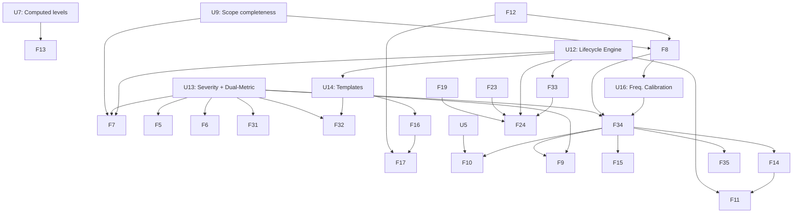

# Risk Influence Map (RIM) — Development Roadmap v3

**Optimised for Multi-Agent Execution**

**Context for Future AI Agents:**
This `ROADMAPv3.md` supersedes `ROADMAPv2.md`. It incorporates **four** new architectural pillars decided following methodology reviews in March 2026:

1. **Risk Lifecycle Management** — 6-state lifecycle with trigger-based activation
2. **Dual-Metric Exposure Model** — Expected Loss (EL) + Tail Risk Indicator (TRI) + quadrant classification
3. **Generic Risk Template architecture** — template/instance pattern for combinatorial risk domains
4. **Severity-Based Exposure + Compound Loss Distribution** — `impact` renamed to `severity` as an intrinsic node property; graph exposure decoupled from financial magnitude; SPICE-calibrated compound Poisson loss model producing a Loss Exceedance Curve (LEC) with ALE as a derived summary statistic. **Pillar 4 also formalises the time dimension of Likelihood through a dual-property model (`likelihood` score 1–10 + `annual_probability` decimal) anchored to a domain-configurable lookup table mapping each score to an annual Poisson rate λ and a return period.**

These are **mandatory** components. They affect the exposure calculator, schema YAML, Neo4j data model, and multiple UI surfaces. Agents must read this document fully before beginning work on any Phase 2 or later feature.

---

## Completed Phases (Reference Only)

- **Phase 1: Foundation, Architecture & Scope Completeness** — **COMPLETE** (v2.23.0)
  - U1–U3, U6–U11, F1–F3, F12–F13, F18–F29, F30 are complete.
  - Generic ContextNode architecture, computed levels, relationship semantics, scope completeness, schema-driven filter system, zone-aware layout, interactive scope sandbox, node property panel, loop detection established.

---

## Architectural Pillars Added in v3

### Pillar 1 — Risk Lifecycle Management

**Motivation:** As programmes scale, the analysis canvas becomes unmanageable. Target: ~100 active nodes on canvas at any time. All lifecycle states are preserved in Neo4j for audit and re-activation.

| Status       | Definition                        | Canvas Visibility         | Exposure Calculated |
| ------------ | --------------------------------- | ------------------------- | ------------------- |
| `active`     | Currently tracked                 | Full opacity              | Yes                 |
| `accepted`   | Formal owner decision             | Hidden by default         | No                  |
| `watching`   | Accepted + monitoring condition   | Low opacity ghost         | No                  |
| `suppressed` | Exposure dropped below threshold  | Very low opacity          | No                  |
| `closed`     | Risk condition no longer exists   | Hidden (audit only)       | No                  |
| `archived`   | Terminal state; retention elapsed | Excluded from all queries | No                  |

**Trigger conditions:** string property `trigger_condition` on `accepted`/`watching` nodes, evaluated by `TriggerEngine` after each exposure run. Fires: `watching` → `active`, `suppressed` → `active`.

**Auto-acceptance:** defined in schema YAML. Blocked for any risk with `severity >= severity_ceiling` (default 7/10) regardless of final exposure. Protects black swans.

**Archiving:** risks in `accepted`/`closed` for > `archive_retention_days` (default 180) with no trigger fires and no linked open mitigations → dashboard alert → archived on explicit user confirmation.

---

### Pillar 2 — Dual-Metric Exposure Model

**Motivation:** `L × S` produces identical scores for (L=0.8, S=2) and (L=0.2, S=8). Different management responses required.

| Metric                        | Formula                                   | Purpose                                    |
| ----------------------------- | ----------------------------------------- | ------------------------------------------ |
| **Expected Loss (EL)**        | `Base_Exposure × Effective_Factor`        | Budgeting, operational prioritisation      |
| **Tail Risk Indicator (TRI)** | `Likelihood × Severity^α` (default α=1.5) | Surfaces severity risks disproportionately |

**Risk Quadrant Classification (computed, not stored in Neo4j):**

| Quadrant    | Condition             | Auto-Accept | Posture                          |
| ----------- | --------------------- | ----------- | -------------------------------- |
| `frequency` | L ≥ 6/10 AND S < 6/10 | Eligible    | Manage routinely                 |
| `severity`  | L < 6/10 AND S ≥ 7/10 | **Blocked** | Explicit human decision required |
| `critical`  | L ≥ 6/10 AND S ≥ 6/10 | **Blocked** | Priority mitigation              |
| `marginal`  | L < 6/10 AND S < 6/10 | Eligible    | Monitor or accept                |

All thresholds configurable per domain in schema YAML under `risk_lifecycle_rules.quadrant_thresholds`.

---

### Pillar 3 — Generic Risk Template Architecture

**Motivation:** Combinatorial risk spaces (e.g. cybersecurity entry_point × technical_target) generate graph explosion. Template/instance pattern contains complexity while preserving full analytical coverage.

- **`GenericRisk`** (`is_template: true`): risk class definition with baseline L and S. Excluded from all exposure calculations and canvas display by default.
- **`SpecificRisk`**: contextual instantiation linked via `[:INSTANTIATES]`. Only specific instances participate in the exposure engine.
- Templates are never subject to lifecycle transitions. They persist indefinitely.

---

### Pillar 4 — Severity-Based Exposure and Compound Loss Distribution

**Semantic correction — the rename:**
The property `impact` was a conflation of two distinct concepts: the intrinsic intensity of a risk event, and the financial consequence it produces. These require different models. `impact` is renamed to `severity` on **all** risk node types (both OperationalRisk and BusinessRisk).

- `severity` (1–10): intrinsic intensity of the risk event itself. Example: compromised admin account (S=8) > compromised user account (S=5), independently of which business objective is threatened.
- This is a **property-level rename only**. The formula `Base_Exposure = Likelihood × Severity` is structurally identical to the previous `L × I`. The propagation engine, mitigation degradation, and influence limitation logic are **unchanged**.
- Mitigations reduce **exposure** (the `L × S` graph score). They do **not** reduce financial magnitude. Magnitude reduction is modelled at the SPICE/financial layer through scenario adjustments.

**Two-tier architecture:**

_Tier 1 — Graph Exposure Layer:_
Inputs: `Likelihood` and `Severity` per risk node. Process: five-step propagation pipeline (unchanged). Output: `final_exposure` (EL, dimensionless 0–100), `TRI`, `risk_quadrant`. No financial units at this layer.

_Tier 2 — Financial Quantification Layer:_

- **Frequency input:** Business Risk `final_exposure` → mapped to Poisson event rate λ via piecewise linear calibration function anchored to SPICE `annual_probability` values.
- **Magnitude input:** SPICE three-point estimates (best / expected / worst-case <10%) → fitted lognormal (default) or GPD (heavy-tail option) loss distribution per Business Risk / Business Perimeter.
- **Process:** compound Poisson Monte Carlo convolution (reusing existing Monte Carlo engine).
- **Output:** aggregate annual loss distribution → **Loss Exceedance Curve (LEC)** → ALE as derived summary statistic.

**Why LEC as primary output (not ALE alone):**
ALE = λ × Mean Magnitude collapses the distribution, masking tail behaviour. The LEC (`P(Annual Loss > x)`) is the standard output of catastrophe risk models in reinsurance, Basel operational risk, and cyber insurance. It naturally captures both EL (area under curve) and tail exposure (far-right portion). The Resilience State thresholds are redefined as exceedance probability thresholds on the LEC — more rigorous than absolute exposure numbers.

**Business Risk severity post-SPICE:** once a Business Risk has at least one SPICE scenario with `fair_calibration_flag: true`, the financial layer takes precedence for monetary output. The `severity` score is retained as a plausibility-weighting input to scenario selection and continues to drive graph propagation to TPOs.

**The time dimension of Likelihood — dual-property model:**

Raw likelihood scores (1–10) are dimensionless ordinal values. The compound loss model requires λ in events/year. To bridge this gap without modifying the graph exposure engine, a dual-property model is adopted:

- `likelihood` (integer 1–10): **unchanged**. Used for graph exposure (L × S), TRI, quadrant classification, and visual display. No change to any existing logic.
- `annual_probability` (decimal, optional): the annual Poisson rate λ in events/year. Populated by one of three mechanisms, evaluated in priority order:
  1. **SPICE calibration** (highest priority): when a SPICE scenario is linked to the Business Risk, its `annual_probability` overrides all other sources.
  2. **Analyst direct entry**: analysts who can express frequency precisely (e.g. "3 events in 15 years → λ = 0.20") enter `annual_probability` directly on the Risk node.
  3. **Lookup table derivation** (fallback): the domain schema YAML defines a `likelihood_to_lambda` table mapping each score to a central λ and a return period. When `annual_probability` is not directly set, the calibrator reads the central λ from this table.

**Default lookup table (configurable per domain in schema YAML):**

| Score | Label        | Annual probability range | Central λ | Return period     |
| ----- | ------------ | ------------------------ | --------- | ----------------- |
| 1     | Exceptional  | < 0.5%                   | 0.003     | ~1 in 300 years   |
| 2     | Very rare    | 0.5%–1%                  | 0.008     | ~1 in 130 years   |
| 3     | Rare         | 1%–2%                    | 0.015     | ~1 in 65 years    |
| 4     | Unlikely     | 2%–5%                    | 0.035     | ~1 in 30 years    |
| 5     | Possible     | 5%–10%                   | 0.075     | ~1 in 13 years    |
| 6     | Moderate     | 10%–20%                  | 0.15      | ~1 in 7 years     |
| 7     | Likely       | 20%–35%                  | 0.28      | ~1 in 3.5 years   |
| 8     | Very likely  | 35%–60%                  | 0.47      | ~1 in 2 years     |
| 9     | Probable     | 60%–85%                  | 0.93      | ~1 per year       |
| 10    | Near-certain | > 85%                    | 2.00      | Multiple per year |

**Key mathematical relationship:** for a Poisson process with annual rate λ, `annual_probability = 1 − e^(−λ)`. The approximation `annual_probability ≈ λ` holds well for scores 1–5 (rare events) but diverges significantly for scores 7–10. The compound loss model always uses λ directly, never the approximate annual probability.

**Programme lifetime view:** when a programme duration T (years) is defined on the root scope or TPO node (`programme_duration_years` property), the UI exposes a toggle displaying `lifetime_probability = 1 − e^(−λ × T)` per risk alongside the annual figure. This is a display calculation only — no stored property changes, no engine changes.

**Priority rule summary:** `annual_probability` used by the frequency calibrator = SPICE scenario value > analyst direct entry on Risk node > lookup table central λ. All three sources populate the same `annual_probability` field; only the population mechanism differs.

**Open design questions for Phase 3/4:**

| Question                   | Default Recommendation                                                   |
| -------------------------- | ------------------------------------------------------------------------ |
| Frequency mapping function | Piecewise linear, calibrated to SPICE `annual_probability`               |
| Magnitude distribution     | Lognormal default; GPD option for nuclear/cyber                          |
| Cross-risk aggregation     | Independent Poisson (Phase 3); copula via SystemicFactor nodes (Phase 5) |
| TRI alpha                  | Domain-configurable in YAML; validated via F31d calibration mode         |

---

## Current Roadmap: Multi-Agent Parallel Execution

### 🌊 Work Stream A — Visual & UI Enhancements

- **[F5] Automated Risk Threshold Alerts** _(Iteration 4)_: EL-based and TRI-based alert flags surfaced distinctly. Configurable thresholds per domain. Scope-aware.

- **[F6] Mitigation Exposure View** _(Iteration 4)_: Business-focused view; lifecycle-filtered; EL + TRI delta per mitigation. Scope-aware.

- **[F32] Graph Visual Behaviour Panel** _(Iteration 5)_: Consolidated visual settings. Lifecycle opacity controls per status. Quadrant border encoding. Presets: Clean / Analysis Deep-Dive / Lifecycle Audit / Sandbox Edit. Persisted to `schema.yaml` under `graph_visual_config`. Supersedes F20, F21, all scatter-shot toggles.

---

### 🌊 Work Stream B — Schema & Data Management

- **[U12] Risk Lifecycle Engine** _(Iteration 4 — MANDATORY before F7)_:
  New status values; `trigger_condition`, `acceptance_date`, `acceptance_owner`, `archive_date` properties; `TriggerEngine`, `AutoAcceptanceEngine`, `ArchiveEngine` services; `risk_lifecycle_rules` YAML block.
  **Testing gate:** trigger conditions evaluate; auto-acceptance blocks severity-ceiling risks; archived nodes excluded from all queries.

- **[U13] Severity Rename + Dual-Metric Exposure** _(Iteration 4 — FIRST TASK in iteration)_:
  - Rename `impact` → `severity` in: schema YAML, all Neo4j node property keys (migration Cypher script required), `exposure_calculator.py`, all UI labels, Node Property Panel, Excel import/export templates, JSON backup schema, all test datasets TC01–TC07, all demo datasets.
  - Migration script: `MATCH (r:Risk) WHERE r.impact IS NOT NULL SET r.severity = r.impact REMOVE r.impact`
  - Extend `exposure_calculator.py`: compute `tail_risk_indicator = likelihood * severity ** alpha` and `risk_quadrant` after EL; stored in `exposure_results` session state only (not persisted to Neo4j).
  - Update Node Property Panel section ②: display `severity`, `tri`, `risk_quadrant`.
  - Update dashboard: quadrant distribution widget. Update filter system: `risk_quadrant` multiselect.
    **Testing gate:** zero residual `impact` references in codebase; TC01–TC07 pass with renamed property; TRI and quadrant correct.

- **[U14] Generic Risk Template Architecture** _(Iteration 5)_:
  `is_template: true` flag; `[:INSTANTIATES]` relationship; template CRUD; instantiation workflow; exclusion from exposure engine; dashed-border visual; parent/sibling section in Node Property Panel.
  **Testing gate:** templates excluded from EL and TRI; INSTANTIATES traversal correct.

---

### 🌊 Work Stream C — Analytical & Simulation Tools

- **[F7] "What-If" Analysis Sandbox** _(Iteration 4)_: Toggle mitigations ON/OFF; in-memory recompute; EL + TRI deltas displayed. Scope-constrained. Lifecycle-aware (suppressed/accepted nodes excluded by default; option to include).

- **[F31] Scope-Driven Simulation & Results Storage** _(Iteration 4 → 5)_ ✅ **Complete**:
  - F31a: scope-based simulation mode with real DB data. ✅
  - F31b: `SimulationRecord` stores EL + TRI distributions; comparison table; Excel export. ✅
  - F31c: lifecycle-aware simulation — "Worst-Case Canvas" toggle re-activates accepted/watching/suppressed/closed risks to reveal latent tail exposure; banner shows latent risk count; results labelled `[Worst-Case]`. ✅ v2.30.0
  - F31d: TRI α Calibration Mode — 4th simulation mode; sweeps α over configurable range; Monte Carlo per α; outputs calibration chart (Mean TRI ±1σ, P95, quadrant distribution stacked bar), calibration report table, recommended α per target profile. `_compute_risk_quadrant` + `TRI_ALPHA` imported from exposure engine. ✅ v2.30.0

- **[U16] Frequency Calibration Infrastructure** _(Iteration 6 — requires SPICE/F8)_:
  - Add `annual_probability` (decimal, optional) to the Risk node schema in YAML and Pydantic model.
  - Add `likelihood_to_lambda` lookup table to domain schema YAML under `exposure_model.likelihood_scale` (see Pillar 4 time dimension spec above for default values).
  - Add `programme_duration_years` (integer, optional) property to Scope or TPO node schema.
  - Implement `FrequencyCalibrator` in `services/frequency_calibrator.py`: resolves `annual_probability` per Risk node using the three-source priority rule (SPICE > direct entry > lookup table); fits monotone sigmoid or piecewise linear curve through SPICE anchor points when ≥ 2 anchors are available; maps `final_exposure → Poisson λ` for the compound loss engine.
  - Add programme lifetime view toggle to Node Property Panel (section ② Exposure Metrics): display both `annual_probability` and `lifetime_probability = 1 − e^(−λ × T)` when `programme_duration_years` is defined.
  - Surface calibration curve in a settings panel sub-tab. Clearly signal "Financial layer not calibrated" state in UI when `annual_probability` cannot be resolved for a given risk.
  - **Testing gate:** calibration curve is monotone; λ values from lookup table match default table entries; SPICE override correctly supersedes direct entry and lookup table; lifetime probability verified (e.g. λ=0.05, T=20 → P≈63.2%).

- **[F34] Compound Loss Model & LEC Engine** _(Iteration 6 — Phase 3 — requires U16)_:
  Requires F8 (SPICE Scenario Manager) and U16 (Frequency Calibration) complete.
  - F34a: magnitude distribution fitting (lognormal/GPD from SPICE three-point estimates; goodness-of-fit display).
  - F34b: Monte Carlo convolution (compound Poisson; 10,000 runs default; aggregate annual loss distribution).
  - F34c: LEC output (`P(Loss > x)` curve; VaR at 95/99/99.5%; Resilience State thresholds overlaid as vertical lines).
  - F34d: ALE derivation (summary statistic alongside LEC).

---

## 🗓️ Active Sprint Plan

### 🔁 Iteration 4 — Severity, Lifecycle, Dual-Metric & What-If _(v2.24.0 → v2.26.0)_

**Critical ordering:** U13 severity rename must be the **first task** — it touches every codebase layer and all downstream tasks depend on the renamed property.

| Task                        | File(s)                                                                                                                    | Details                                                                                   |
| --------------------------- | -------------------------------------------------------------------------------------------------------------------------- | ----------------------------------------------------------------------------------------- |
| **U13 rename (first)**      | `schema.yaml`, `models/risk.py`, `services/exposure_calculator.py`, all UI files, all test/demo datasets                   | Rename `impact` → `severity`. Run migration Cypher. Run full TC01–TC07 suite.             |
| **U12** Lifecycle Engine    | `services/trigger_engine.py`, `services/auto_acceptance.py`, `services/archive_engine.py`, `schema.yaml`, `models/risk.py` | 6-state lifecycle; triggers; auto-acceptance with severity ceiling guard; archive alerts. |
| **U13 cont.** Dual-Metric   | `services/exposure_calculator.py`, `ui/panels/node_property_panel.py`, `ui/home.py`                                        | TRI + quadrant computation; panel update; dashboard widget; quadrant filter.              |
| **F7** What-If              | `pages/3_🔬_Analysis.py`, `services/exposure_calculator.py`                                                                | In-memory mitigation toggle; EL + TRI deltas; scope + lifecycle constrained.              |
| **F31a/b** Scope Simulation | `pages/2_🎲_Simulation.py`, `utils/simulation_store.py` (new)                                                              | Real-data mode; EL+TRI distributions stored; Excel export.                                |

---

### 🔁 Iteration 5 — Templates, Alerts & Visual Behaviour _(v2.27.0 → v2.29.0)_

| Task                     | File(s)                                                                                                                               | Details                                                                                                 |
| ------------------------ | ------------------------------------------------------------------------------------------------------------------------------------- | ------------------------------------------------------------------------------------------------------- |
| **U14** Templates        | `models/risk.py`, `schema.yaml`, `ui/tabs/unified_crud_tab.py`, `services/exposure_calculator.py`, `ui/panels/node_property_panel.py` | Template flag; INSTANTIATES relationship; template CRUD; instantiation workflow; exclusion from engine. |
| **F5** Alerts            | `ui/home.py`, `schema.yaml`                                                                                                           | EL + TRI threshold alerts; distinct display; configurable.                                              |
| **F6** Mitigation View   | `pages/3_🔬_Analysis.py`                                                                                                              | Business Risk mitigation view; lifecycle filter; EL+TRI delta.                                          |
| **F32** Visual Panel     | `ui/panels/graph_visual_panel.py` (new), `schema.yaml`                                                                                | Consolidated settings; lifecycle opacity; quadrant encoding; presets persisted to YAML.                 |
| **F31c/d** Simulation ✅ | `pages/2_🎲_Simulation.py`                                                                                                            | Lifecycle-aware mode (Worst-Case Canvas); TRI α calibration mode. v2.30.0                               |

---

### 🔁 Iteration 6 — SPICE, Financial Layer & LEC _(v2.30.0+, Phase 3)_

| Task                      | File(s)                                                                                                       | Details                                                                                                                                                                                     |
| ------------------------- | ------------------------------------------------------------------------------------------------------------- | ------------------------------------------------------------------------------------------------------------------------------------------------------------------------------------------- |
| **U16** Freq. Calibration | `services/frequency_calibrator.py` (new), `models/risk.py`, `schema.yaml`, `ui/panels/node_property_panel.py` | Add `annual_probability` + `programme_duration_years` to schema; implement `FrequencyCalibrator` with 3-source priority rule; lookup table from YAML; lifetime probability toggle in panel. |
| **F8** SPICE Manager      | `pages/4_📊_Scenarios.py` (new), schema YAML                                                                  | Scenario ContextNode CRUD; SCENARIO_ILLUSTRATES links; activation flag for triggers.                                                                                                        |
| **F34a–d** Loss Model     | `services/loss_model.py` (new), `pages/5_📉_Loss_Model.py` (new)                                              | Magnitude fitting → Monte Carlo convolution → LEC → ALE. Requires U16 and F8 complete.                                                                                                      |
| **F9** Resilience State   | `services/resilience.py`                                                                                      | Thresholds redefined as LEC exceedance probabilities; TRI incorporated alongside EL.                                                                                                        |
| **F15** P&L Dashboard     | dedicated page                                                                                                | EBIT-at-risk / FCF-at-risk per Business Perimeter; LEC per perimeter.                                                                                                                       |

---

## Future Horizons

### 🌊 Work Stream D — Advanced Financial Modelling _(after Iteration 6)_

- **[F14] FAIR-like Formalisation**: map F34 outputs to explicit FAIR terminology; ALE output alongside LEC; alignment documentation for Basel/Solvency II regulated environments.
- **[F10] Mitigation Budget Optimisation**: CAPEX/OPEX-constrained; LEC-derived ALE as objective function.
- **[F35] Copula Correlation Model** _(new)_: correlated loss events across Business Risks; correlation structure derived from SystemicFactor ContextNodes. Gaussian copula default; t-copula option for heavy-tail joint distributions.

### 🌊 Work Stream E — Advanced Architecture

- **[F16] SubGraph Promotion**: `AnalysisScopeConfig` → `SubGraphConfig` with hierarchy and boundary policies. Generic Risk Templates inheritable by child SubGraphs.
- **[F17] External Graph Ingestion**: YAML adapters; imported edges always `semantic:context`.
- **[F11] Historical Versioning**: graph state at any past date; lifecycle transitions versioned.

### 🌊 Work Stream F — Advanced Graphical Interaction

- **[F24] Interactive Canvas Editing**: lifecycle-aware (archived/closed nodes not re-activatable via canvas drag).
- **[F33] Lifecycle Management UI**: bulk accept/archive; trigger condition editor; lifecycle history timeline per risk; full audit trail.

---

## Open Questions

**Q1** Cross-stream dependency handover protocol to prevent merge conflicts during parallel execution.

**Q2** Isolated database namespaces for agent testing gateways.

**Q3** Schema context management as YAML grows to include lifecycle rules, loss model parameters, and template configurations.

**Q4** Should `is_template: true` nodes carry `computational: false` to make exclusion from the exposure engine declarative?

**Q5** Trigger condition sandboxing — restricted DSL vs arbitrary Python eval; what is the approved approach?

**Q6** TRI alpha default (1.5) unvalidated against real data. What is the approval process for domain-specific changes?

**Q7** Frequency mapping calibration: who provides and validates initial Poisson λ anchor points per domain schema, and what is the override mechanism for domains without SPICE scenario data?

**Q8** Business Risk severity post-SPICE: proposed rule is that once a Business Risk has a SPICE scenario with `fair_calibration_flag: true`, `severity` drives graph propagation only (not financial output). Is this the right clean separation rule?

**Q13** Likelihood scale anchoring — ordinal vs. annual-probability-anchored: the `likelihood` score (1–10) is currently an ordinal scale. The dual-property model (U16) introduces `annual_probability` as the true frequency input to the compound loss model, with the lookup table as the fallback. Should the `likelihood` scale be formally re-defined as annual-probability-anchored (each score has a precise probability range, as in the default lookup table), or remain ordinal with the lookup table as a loose calibration aid? The choice materially affects LEC reliability before SPICE calibration is complete. **Resolve before Iteration 6 begins.**

---

## Feature Dependency Map



---

## Schema YAML Extensions Required (Summary)

```yaml
# Severity rename (U13) — Cypher migration:
# MATCH (r:Risk) WHERE r.impact IS NOT NULL
# SET r.severity = r.impact REMOVE r.impact

# Lifecycle rules (U12 + U13)
risk_lifecycle_rules:
  acceptance_threshold: 20
  severity_ceiling: 7
  archive_retention_days: 180
  quadrant_thresholds:
    likelihood_threshold: 6
    severity_threshold_frequency: 6
    severity_threshold_severity: 7

# Dual-Metric + Likelihood time dimension (U13, U16)
exposure_model:
  tri_alpha: 1.5
  likelihood_scale: # Pillar 4 — lookup table for likelihood → λ mapping (U16)
    reference_period: annual # annual | programme_lifetime
    programme_duration_years: null # set on root scope/TPO if reference_period = programme_lifetime
    likelihood_to_lambda: # central λ (events/year) per score; configurable per domain
      1:
        {
          label: "Exceptional",
          annual_prob_range: [0.000, 0.005],
          central_lambda: 0.003,
          return_period_years: 300,
        }
      2:
        {
          label: "Very rare",
          annual_prob_range: [0.005, 0.010],
          central_lambda: 0.008,
          return_period_years: 130,
        }
      3:
        {
          label: "Rare",
          annual_prob_range: [0.010, 0.020],
          central_lambda: 0.015,
          return_period_years: 65,
        }
      4:
        {
          label: "Unlikely",
          annual_prob_range: [0.020, 0.050],
          central_lambda: 0.035,
          return_period_years: 30,
        }
      5:
        {
          label: "Possible",
          annual_prob_range: [0.050, 0.100],
          central_lambda: 0.075,
          return_period_years: 13,
        }
      6:
        {
          label: "Moderate",
          annual_prob_range: [0.100, 0.200],
          central_lambda: 0.150,
          return_period_years: 7,
        }
      7:
        {
          label: "Likely",
          annual_prob_range: [0.200, 0.350],
          central_lambda: 0.280,
          return_period_years: 4,
        }
      8:
        {
          label: "Very likely",
          annual_prob_range: [0.350, 0.600],
          central_lambda: 0.470,
          return_period_years: 2,
        }
      9:
        {
          label: "Probable",
          annual_prob_range: [0.600, 0.850],
          central_lambda: 0.930,
          return_period_years: 1,
        }
      10:
        {
          label: "Near-certain",
          annual_prob_range: [0.850, 1.000],
          central_lambda: 2.000,
          return_period_years: 0.5,
        }
  frequency_calibration:
    anchors: [] # [(exposure_score, annual_probability)] from SPICE — populated by U16
    curve_type: sigmoid # sigmoid | piecewise_linear
    calibrated: false

# Loss model (F34)
loss_model:
  frequency_mapping: piecewise_linear
  magnitude_distribution: lognormal
  monte_carlo_runs: 10000
  var_confidence_levels: [0.95, 0.99, 0.995]
  resilience_thresholds:
    robust_exceedance_probability: 0.20
    fragile_exceedance_probability: 0.05

# Graph visual defaults (F32)
graph_visual_config:
  lifecycle_opacity:
    watching: 0.35
    suppressed: 0.15
  quadrant_border_encoding: true
  default_preset: "analysis"
```
