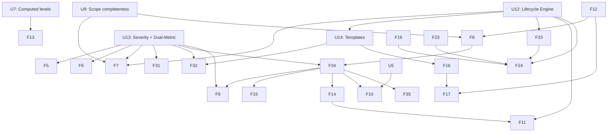

# Risk Influence Map (RIM) — Development Roadmap v3

**Optimised for Multi-Agent Execution**

**Context for Future AI Agents:**
This `ROADMAPv3.md` supersedes `ROADMAPv2.md`. It incorporates **four** new architectural pillars decided following methodology reviews in March 2026:

1. **Risk Lifecycle Management** — 6-state lifecycle with trigger-based activation
2. **Dual-Metric Exposure Model** — Expected Loss (EL) + Tail Risk Indicator (TRI) + quadrant classification
3. **Generic Risk Template architecture** — template/instance pattern for combinatorial risk domains
4. **Severity-Based Exposure + Compound Loss Distribution** — `impact` renamed to `severity` as an intrinsic node property; graph exposure decoupled from financial magnitude; SPICE-calibrated compound Poisson loss model producing a Loss Exceedance Curve (LEC) with ALE as a derived summary statistic

These are **mandatory** components. They affect the exposure calculator, schema YAML, Neo4j data model, and multiple UI surfaces. Agents must read this document fully before beginning work on any Phase 2 or later feature.

---

## Completed Phases (Reference Only)

*   **Phase 1: Foundation, Architecture & Scope Completeness** — **COMPLETE** (v2.23.0)
    *   U1–U3, U6–U11, F1–F3, F12–F13, F18–F29, F30 are complete.
    *   Generic ContextNode architecture, computed levels, relationship semantics, scope completeness, schema-driven filter system, zone-aware layout, interactive scope sandbox, node property panel, loop detection established.

*   **Iteration 4 — COMPLETE** (v2.26.0)
    *   **F31a** Scope-Based Simulation mode — **COMPLETE** (v2.24.0). Files: `pages/2_🎲_Simulation.py`, `utils/simulation_store.py` (new), `utils/state_manager.py`.
    *   **F31b** Simulation Results Storage — **COMPLETE** (v2.24.0). `SimulationRecord` dataclass; saved-results comparison table with Δ delta columns; Excel export.
    *   **U13** Severity Rename + Dual-Metric Exposure — **COMPLETE** (v2.25.0). `Risk.impact` → `Risk.severity`; TRI (likelihood × severity^1.5) + risk quadrant computed metrics; quadrant dashboard widget + sidebar filter; cypher scripts reorganised to `scripts/`.
    *   **U12** Risk Lifecycle Engine — **COMPLETE** (v2.25.1). 6-state lifecycle; `TriggerEngine`; `AutoAcceptanceEngine` with 3 guards + Force Accept override; `ArchiveEngine`; `exclude_inactive=True` on analytical queries; scope-aware engine; lifecycle node property panel; help article.
    *   **F7** What-If Analysis — **COMPLETE** (v2.26.0). `pages/3_🔬_What-If_Analysis.py`; in-memory mitigation toggle; EL + WRS deltas; Max Single Risk EL summary metric; scope + lifecycle constrained. *(v2.28.1: TRI delta columns removed — TRI is mitigation-independent.)*

*   **Iteration 5 — Partial** (v2.28.0)
    *   **U14** Templates — **COMPLETE** (v2.27.0). `is_template` flag; `INSTANTIATES` rel; template library UI + instantiation workflow in CRUD tab; exclusion from exposure engine + canvas; node property panel section.
    *   **F5** Alerts — **COMPLETE** (v2.27.0). `AlertThresholdsConfig`; `high_exposure_threshold` + TRI threshold alerts in exposure expander; configurable per domain YAML.
    *   **v2.27.1** Post-release fixes: `boolean`→`bool` attribute alias; YAML encoding fix; INSTANTIATES edge safety filter; `high_exposure_threshold` rename; Subtype selector in risk create/edit forms.
    *   **F6** Mitigation Exposure View — **COMPLETE** (v2.28.0). `pages/4_📊_Mitigation_Exposure.py`; counterfactual per-mitigation EL delta; % Portfolio EL; % EL (Covered Risks); scope + lifecycle constrained; level filter; `MITIGATION_EXPOSURE_DEFAULTS` in state manager. *(v2.28.1: TRI Delta ↑ removed; % EL (Covered Risks) added.)*

---

## Architectural Pillars Added in v3

### Pillar 1 — Risk Lifecycle Management

**Motivation:** As programmes scale, the analysis canvas becomes unmanageable. Target: ~100 active nodes on canvas at any time. All lifecycle states are preserved in Neo4j for audit and re-activation.

| Status | Definition | Canvas Visibility | Exposure Calculated |
|--------|-----------|-------------------|---------------------|
| `active` | Currently tracked | Full opacity | Yes |
| `accepted` | Formal owner decision | Hidden by default | No |
| `watching` | Accepted + monitoring condition | Low opacity ghost | No |
| `suppressed` | Exposure dropped below threshold | Very low opacity | No |
| `closed` | Risk condition no longer exists | Hidden (audit only) | No |
| `archived` | Terminal state; retention elapsed | Excluded from all queries | No |

**Trigger conditions:** string property `trigger_condition` on `accepted`/`watching` nodes, evaluated by `TriggerEngine` after each exposure run. Fires: `watching` → `active`, `suppressed` → `active`.

**Auto-acceptance:** defined in schema YAML. Blocked for any risk with `severity >= severity_ceiling` (default 7/10) regardless of final exposure. Protects black swans.

**Archiving:** risks in `accepted`/`closed` for > `archive_retention_days` (default 180) with no trigger fires and no linked open mitigations → dashboard alert → archived on explicit user confirmation.

---

### Pillar 2 — Dual-Metric Exposure Model

**Motivation:** `L × S` produces identical scores for (L=0.8, S=2) and (L=0.2, S=8). Different management responses required.

| Metric | Formula | Purpose |
|--------|---------|---------|
| **Expected Loss (EL)** | `Base_Exposure × Effective_Factor` | Budgeting, operational prioritisation |
| **Tail Risk Indicator (TRI)** | `Likelihood × Severity^α` (default α=1.5) | Surfaces severity risks disproportionately |

**Risk Quadrant Classification (computed, not stored in Neo4j):**

| Quadrant | Condition | Auto-Accept | Posture |
|----------|-----------|-------------|---------|
| `frequency` | L ≥ 6/10 AND S < 6/10 | Eligible | Manage routinely |
| `severity` | L < 6/10 AND S ≥ 7/10 | **Blocked** | Explicit human decision required |
| `critical` | L ≥ 6/10 AND S ≥ 6/10 | **Blocked** | Priority mitigation |
| `marginal` | L < 6/10 AND S < 6/10 | Eligible | Monitor or accept |

All thresholds configurable per domain in schema YAML under `risk_lifecycle_rules.quadrant_thresholds`.

**Portfolio-Level Metric — Weighted Risk Score (WRS):**

| Metric | Formula | Purpose |
|--------|---------|---------|
| **WRS** | `WRS = Σ(FEᵢ × Sᵢ²) / Σ(Sᵢ²)` | Portfolio-level exposure summary with severity-squared weighting; high-severity risks contribute disproportionately to the headline score |

WRS is a read-time derived statistic — not stored in Neo4j. Computed over the active scope (or full graph when no scope is active). Provides a single headline figure for executive dashboards, complementing per-risk EL and TRI values. Implementation: single-pass summation over `exposure_results`; no additional DB queries required.

---

### Pillar 3 — Generic Risk Template Architecture

**Motivation:** Combinatorial risk spaces (e.g. cybersecurity entry_point × technical_target) generate graph explosion. Template/instance pattern contains complexity while preserving full analytical coverage.

- **`GenericRisk`** (`is_template: true`): risk class definition with baseline L and S. Excluded from all exposure calculations and canvas display by default.
- **`SpecificRisk`**: contextual instantiation linked via `[:INSTANTIATES]`. Only specific instances participate in the exposure engine.
- Templates are never subject to lifecycle transitions. They persist indefinitely.

---

### Pillar 4 — Severity-Based Exposure and Compound Loss Distribution

**Semantic correction — the rename:**
The property `impact` was a conflation of two distinct concepts: the intrinsic intensity of a risk event, and the financial consequence it produces. These require different models. `impact` is renamed to `severity` on **all** risk node types (both OperationalRisk and BusinessRisk).

- `severity` (1–10): intrinsic intensity of the risk event itself. Example: compromised admin account (S=8) > compromised user account (S=5), independently of which business objective is threatened.
- This is a **property-level rename only**. The formula `Base_Exposure = Likelihood × Severity` is structurally identical to the previous `L × I`. The propagation engine, mitigation degradation, and influence limitation logic are **unchanged**.
- Mitigations reduce **exposure** (the `L × S` graph score). They do **not** reduce financial magnitude. Magnitude reduction is modelled at the SPICE/financial layer through scenario adjustments.

**Two-tier architecture:**

*Tier 1 — Graph Exposure Layer:*
Inputs: `Likelihood` and `Severity` per risk node. Process: five-step propagation pipeline (unchanged). Output: `final_exposure` (EL, dimensionless 0–100), `TRI`, `risk_quadrant`. No financial units at this layer.

*Tier 2 — Financial Quantification Layer:*
- **Frequency input:** Business Risk `final_exposure` → mapped to Poisson event rate λ via piecewise linear calibration function anchored to SPICE `annual_probability` values.
- **Magnitude input:** SPICE three-point estimates (best / expected / worst-case <10%) → fitted lognormal (default) or GPD (heavy-tail option) loss distribution per Business Risk / Business Perimeter.
- **Process:** compound Poisson Monte Carlo convolution (reusing existing Monte Carlo engine).
- **Output:** aggregate annual loss distribution → **Loss Exceedance Curve (LEC)** → four derived summary statistics: **ALE** (area under complementary CDF = expected annual loss), **VaR** (loss threshold at specified percentile), **CVaR / Expected Shortfall** (mean loss in excess of VaR threshold — tail risk management, reinsurance pricing), and **TRI** (graph-layer tail signal carried forward for cross-layer comparison).

**Why LEC as primary output (not ALE alone):**
ALE = λ × Mean Magnitude collapses the distribution, masking tail behaviour. The LEC (`P(Annual Loss > x)`) is the standard output of catastrophe risk models in reinsurance, Basel operational risk, and cyber insurance. It naturally captures both EL (area under curve) and tail exposure (far-right portion). The Resilience State thresholds are redefined as exceedance probability thresholds on the LEC — more rigorous than absolute exposure numbers.

**Regulatory alignment:** The LEC at the 99.5th percentile (VaR₉₉.₅) maps directly to the Solvency II Solvency Capital Requirement (SCR). The default `var_confidence_levels: [0.95, 0.99, 0.995]` in the schema YAML is already calibrated to this anchor. For Basel operational risk (Advanced Measurement Approach), the regulatory anchor is the 99.9th percentile — add `0.999` to the confidence level list in domain-specific schema overrides. Both connections are formally documented in the RIM Methodology Technical Reference (§C.2, §C.4, March 2026).

**Business Risk severity post-SPICE:** once a Business Risk has at least one SPICE scenario with `fair_calibration_flag: true`, the financial layer takes precedence for monetary output. The `severity` score is retained as a plausibility-weighting input to scenario selection and continues to drive graph propagation to TPOs.

**Open design questions for Phase 3/4:**

| Question | Default Recommendation |
|----------|----------------------|
| Frequency mapping function | Piecewise linear, calibrated to SPICE `annual_probability` |
| Magnitude distribution | Lognormal default; GPD option for nuclear/cyber |
| Cross-risk aggregation | Independent Poisson (Phase 3); copula via SystemicFactor nodes (Phase 5) |
| TRI alpha | Domain-configurable in YAML; validated via F31d calibration mode |

---

## Current Roadmap: Multi-Agent Parallel Execution

### 🌊 Work Stream A — Visual & UI Enhancements

*   **[F5] Automated Risk Threshold Alerts** *(Iteration 5 — **COMPLETE** v2.27.0)*: EL-based and TRI-based alert flags surfaced in exposure expander. `AlertThresholdsConfig` in schema YAML. `_render_threshold_alerts()` in `ui/home.py`.

*   **[F6] Mitigation Exposure View** *(Iteration 4)*: Business-focused view; lifecycle-filtered; EL + TRI delta per mitigation. Scope-aware.

*   **[F32] Graph Visual Behaviour Panel** *(Iteration 5)*: Consolidated visual settings. Lifecycle opacity controls per status. Quadrant border encoding. Presets: Clean / Analysis Deep-Dive / Lifecycle Audit / Sandbox Edit. Persisted to `schema.yaml` under `graph_visual_config`. Supersedes F20, F21, all scatter-shot toggles.

---

### 🌊 Work Stream B — Schema & Data Management

*   **[U12] Risk Lifecycle Engine** *(Iteration 4 — MANDATORY before F7)*:
    New status values; `trigger_condition`, `acceptance_date`, `acceptance_owner`, `archive_date` properties; `TriggerEngine`, `AutoAcceptanceEngine`, `ArchiveEngine` services; `risk_lifecycle_rules` YAML block.
    **Testing gate:** trigger conditions evaluate; auto-acceptance blocks severity-ceiling risks; archived nodes excluded from all queries.

*   **[U13] Severity Rename + Dual-Metric Exposure** *(Iteration 4 — FIRST TASK in iteration)*:
    - Rename `impact` → `severity` in: schema YAML, all Neo4j node property keys (migration Cypher script required), `exposure_calculator.py`, all UI labels, Node Property Panel, Excel import/export templates, JSON backup schema, all test datasets TC01–TC07, all demo datasets.
    - Migration script: `MATCH (r:Risk) WHERE r.impact IS NOT NULL SET r.severity = r.impact REMOVE r.impact`
    - Extend `exposure_calculator.py`: compute `tail_risk_indicator = likelihood * severity ** alpha` and `risk_quadrant` after EL; stored in `exposure_results` session state only (not persisted to Neo4j).
    - Update Node Property Panel section ②: display `severity`, `tri`, `risk_quadrant`.
    - Update dashboard: quadrant distribution widget. Update filter system: `risk_quadrant` multiselect.
    **Testing gate:** zero residual `impact` references in codebase; TC01–TC07 pass with renamed property; TRI and quadrant correct.

*   **[U14] Generic Risk Template Architecture** *(Iteration 5)*:
    `is_template: true` flag; `[:INSTANTIATES]` relationship; template CRUD; instantiation workflow; exclusion from exposure engine; dashed-border visual; parent/sibling section in Node Property Panel.
    **Testing gate:** templates excluded from EL and TRI; INSTANTIATES traversal correct.

---

### 🌊 Work Stream C — Analytical & Simulation Tools

*   **[F7] "What-If" Analysis Sandbox** *(Iteration 4 — **COMPLETE** v2.26.0)*: Toggle mitigations ON/OFF; in-memory recompute; EL + TRI + WRS deltas; health status change alert; per-risk delta table. Scope-constrained. Lifecycle-aware (suppressed/accepted nodes excluded by default; "Include inactive" checkbox for worst-case). `pages/3_🔬_What-If_Analysis.py`.

*   **[F31] Scope-Driven Simulation & Results Storage**:
    - ~~**F31a** *(v2.24.0 — COMPLETE)*: scope-based simulation mode with real DB data; real/random L×S toggle; mitigation variance slider.~~
    - ~~**F31b** *(v2.24.0 — COMPLETE)*: `SimulationRecord` dataclass; saved-results comparison table with Δ delta columns; Excel export; `utils/simulation_store.py` (new).~~
    - **F31c** *(Iteration 5)*: lifecycle-aware simulation — re-activate all accepted/watching risks to reveal latent tail exposure on worst-case canvas.
    - **F31d** *(Iteration 5)*: TRI alpha calibration mode — vary α over configurable range; observe quadrant distribution shift; output calibration report for domain-appropriate α selection.

*   **[F34] Compound Loss Model & LEC Engine** *(Iteration 6 — Phase 3)*:
    Requires F8 (SPICE Scenario Manager) complete.
    - F34a: frequency calibration (exposure → Poisson λ; SPICE-anchored; calibration UI).
    - F34b: magnitude distribution fitting (lognormal/GPD from SPICE three-point estimates; goodness-of-fit display).
    - F34c: Monte Carlo convolution (compound Poisson; 10,000 runs default; aggregate annual loss distribution).
    - F34d: LEC output (`P(Loss > x)` curve; VaR at 95/99/99.5%; CVaR/Expected Shortfall at each VaR threshold; Resilience State thresholds overlaid as vertical lines; ALE annotated as area under complementary CDF).
    - F34e: ALE derivation (summary statistic alongside LEC; mathematically equivalent to area under LEC).

    **Implementation estimates** (~8–10 developer-days total, ~300 lines net new Python, ~80% reuse of existing MC engine):

    | Sub-task | Effort | Lines net new | Notes |
    |----------|--------|---------------|-------|
    | F34a — frequency calibration | ~0.5 day | ~10 | SPICE anchor mapping via `np.interp` |
    | F34b — magnitude distribution fitting | ~0.5 day | ~15 | Lognormal + GPD; SPICE three-point PERT fit |
    | F34c — compound Poisson MC | ~2–3 days | ~100 | Main effort; reuses existing MC engine loops |
    | F34d — LEC + CVaR visualisation | ~1 day | ~50 | Plotly trace; VaR/CVaR/ALE overlays |
    | F34e — ALE derivation | ~0.5 day | ~15 | Area under complementary CDF |
    | **F8 (SPICE Manager — blocker)** | ~1–2 days | ~30 Python + 5 Cypher | Must complete before F34; critical path |

    F8 (SPICE Scenario Manager) is the critical path dependency — not the mathematics. Once SPICE data exists in the graph, the financial quantification pipeline is ~1 week of focused development.

---

## 🗓️ Active Sprint Plan

### 🔁 Iteration 4 — Severity, Lifecycle, Dual-Metric & What-If *(v2.25.0 → v2.26.0)*

**Critical ordering:** U13 severity rename must be the **first task** — it touches every codebase layer and all downstream tasks depend on the renamed property. F31a/b are already complete (v2.24.0).

| Task | Version | File(s) | Details |
|------|---------|---------|---------|
| ~~**F31a/b** Scope Simulation~~ | ~~v2.24.0~~ | ~~`pages/2_🎲_Simulation.py`, `utils/simulation_store.py`~~ | ~~COMPLETE. Real-data mode; saved results; Excel export.~~ |
| ~~**U13 rename (first)**~~ ✅ _(v2.25.0)_ | ~~v2.25.0~~ | ~~`schema.yaml`, `models/risk.py`, `services/exposure_calculator.py`, all UI files, all test/demo datasets~~ | ~~Rename `impact` → `severity`. Run migration Cypher. Run full TC01–TC07 suite.~~ |
| ~~**U12** Lifecycle Engine~~ ✅ _(v2.25.0)_ | ~~v2.25.0~~ | ~~`services/trigger_engine.py`, `services/auto_acceptance_engine.py`, `services/archive_engine.py`, `schemas/default/schema.yaml`, `models/risk.py`, `models/enums.py`, `config/schema_loader.py`, `database/queries/risks.py`~~ | ~~6-state lifecycle; trigger review; auto-acceptance with severity ceiling guard; archive alerts; `exclude_inactive=True` on analytical queries; `get_archive_candidates()` query.~~ |
| ~~**U13 cont.** Dual-Metric + WRS~~ ✅ _(v2.25.0)_ | ~~v2.25.0~~ | ~~`services/exposure_calculator.py`, `ui/panels/node_property_panel.py`, `ui/home.py`~~ | ~~TRI + quadrant computation; WRS portfolio metric; panel update; dashboard widgets; quadrant filter.~~ |
| ~~**F7** What-If~~ ✅ _(v2.26.0 / v2.28.1)_ | ~~v2.26.0~~ | ~~`pages/3_🔬_What-If_Analysis.py`, `utils/state_manager.py`~~ | ~~In-memory mitigation toggle; EL + WRS deltas; Max Single Risk EL summary metric; health status change alert; per-risk delta table; scope + lifecycle constrained; Reset Scenario button. TRI delta columns removed (v2.28.1).~~ |

---

### 🔁 Iteration 5 — Templates, Alerts & Visual Behaviour *(v2.27.0 → v2.30.0)*

| Task | Version | File(s) | Details |
|------|---------|---------|---------|
| ~~**U14** Templates~~ ✅ _(v2.27.0)_ | ~~v2.27.0~~ | ~~`models/risk.py`, `schema.yaml`, `ui/tabs/unified_crud_tab.py`, `database/queries/risks.py`, `database/manager.py`, `ui/panels/node_property_panel.py`~~ | ~~`is_template` flag; `INSTANTIATES` rel; `get_all_templates()`, `create_instantiates_rel()`; template library UI in CRUD tab; instantiation workflow; exclusion from exposure engine + canvas.~~ |
| ~~**F5** Alerts~~ ✅ _(v2.27.0)_ | ~~v2.27.0~~ | ~~`ui/home.py`, `schema.yaml`, `config/schema_loader.py`~~ | ~~`AlertThresholdsConfig`; EL + TRI threshold alerts; `_render_threshold_alerts()`; configurable per domain in YAML.~~ |
| ~~**F6** Mitigation View~~ ✅ _(v2.28.0 / v2.28.1)_ | ~~v2.28.0~~ | ~~`pages/4_📊_Mitigation_Exposure.py`, `utils/state_manager.py`~~ | ~~Counterfactual per-mitigation EL delta; % Portfolio EL; % EL (Covered Risks); scope + lifecycle constrained; level filter; `MITIGATION_EXPOSURE_DEFAULTS`. TRI Delta ↑ removed (v2.28.1).~~ |
| **F32** Visual Panel | v2.28.0 | `ui/panels/graph_visual_panel.py` (new), `schema.yaml` | Consolidated settings; lifecycle opacity; quadrant encoding; presets persisted to YAML. |
| **F31c** Lifecycle-aware simulation | v2.29.0 | `pages/2_🎲_Simulation.py` | Re-activate all accepted/watching risks; reveal latent tail exposure on worst-case canvas. Requires U12 complete. |
| **F31d** TRI alpha calibration | v2.30.0 | `pages/2_🎲_Simulation.py` | Vary α over configurable range; observe quadrant distribution shift; output calibration report for domain-appropriate α selection. Requires U13 TRI computation complete. |

---

### 🔁 Iteration 6 — SPICE, Financial Layer & LEC *(v2.30.0+, Phase 3)*

| Task | File(s) | Details |
|------|---------|---------|
| **F8** SPICE Manager | `pages/4_📊_Scenarios.py` (new), schema YAML | Scenario ContextNode CRUD; SCENARIO_ILLUSTRATES links; activation flag for triggers. |
| **F34a–e** Loss Model | `services/loss_model.py` (new), `pages/5_📉_Loss_Model.py` (new) | Full compound Poisson pipeline: calibration → fitting → convolution → LEC → ALE. |
| **F9** Resilience State | `services/resilience.py` | Thresholds redefined as LEC exceedance probabilities; TRI incorporated alongside EL. |
| **F15** P&L Dashboard | dedicated page | EBIT-at-risk / FCF-at-risk per Business Perimeter; LEC per perimeter. |

---

## Future Horizons

### 🌊 Work Stream D — Advanced Financial Modelling *(after Iteration 6)*

*   **[F14] FAIR-like Formalisation**: map F34 outputs to explicit FAIR terminology; ALE output alongside LEC; alignment documentation for Basel/Solvency II regulated environments.
*   **[F10] Mitigation Budget Optimisation**: CAPEX/OPEX-constrained; LEC-derived ALE as objective function.
*   **[F35] Copula Correlation Model** *(new)*: correlated loss events across Business Risks; correlation structure derived from SystemicFactor ContextNodes. Gaussian copula default; t-copula option for heavy-tail joint distributions.

### 🌊 Work Stream E — Advanced Architecture

*   **[F16] SubGraph Promotion**: `AnalysisScopeConfig` → `SubGraphConfig` with hierarchy and boundary policies. Generic Risk Templates inheritable by child SubGraphs.
*   **[F17] External Graph Ingestion**: YAML adapters; imported edges always `semantic:context`.
*   **[F11] Historical Versioning**: graph state at any past date; lifecycle transitions versioned.

### 🌊 Work Stream F — Advanced Graphical Interaction

*   **[F24] Interactive Canvas Editing**: lifecycle-aware (archived/closed nodes not re-activatable via canvas drag).
*   **[F33] Lifecycle Management UI**: bulk accept/archive; trigger condition editor; lifecycle history timeline per risk; full audit trail.

---

## Open Questions

**Q1** Cross-stream dependency handover protocol to prevent merge conflicts during parallel execution.

**Q2** Isolated database namespaces for agent testing gateways.

**Q3** Schema context management as YAML grows to include lifecycle rules, loss model parameters, and template configurations.

**Q4** Should `is_template: true` nodes carry `computational: false` to make exclusion from the exposure engine declarative?

**Q5** Trigger condition sandboxing — restricted DSL vs arbitrary Python eval; what is the approved approach?

**Q6** TRI alpha default (1.5) unvalidated against real data. Calibration path: F31d (TRI alpha calibration mode, Iteration 5) produces a calibration report showing quadrant distribution shift across the α range — domain owner reviews and approves a domain-specific α value stored in `exposure_model.tri_alpha` in the domain's schema YAML. Open question: what governance gate (if any) is required before overriding the default in a production schema?

**Q7** Frequency mapping calibration: who provides and validates initial Poisson λ anchor points per domain schema, and what is the override mechanism for domains without SPICE scenario data?

**Q8** Business Risk severity post-SPICE: proposed rule is that once a Business Risk has a SPICE scenario with `fair_calibration_flag: true`, `severity` drives graph propagation only (not financial output). Is this the right clean separation rule?

**Q9** WRS (Weighted Risk Score) UI integration: should WRS replace or supplement the existing portfolio-level exposure summary on the executive dashboard? If supplement, what is the display priority relative to mean EL and peak TRI? Should the WRS be scope-aware only (computed over active scope) or always available on the full graph?

---

## Feature Dependency Map



---

## Schema YAML Extensions Required (Summary)

```yaml
# Severity rename (U13) — Cypher migration:
# MATCH (r:Risk) WHERE r.impact IS NOT NULL
# SET r.severity = r.impact REMOVE r.impact

# Lifecycle rules (U12 + U13)
risk_lifecycle_rules:
  acceptance_threshold: 20
  severity_ceiling: 7
  archive_retention_days: 180
  quadrant_thresholds:
    likelihood_threshold: 6
    severity_threshold_frequency: 6
    severity_threshold_severity: 7

# Dual-Metric (U13) — includes portfolio WRS
exposure_model:
  tri_alpha: 1.5
  wrs_enabled: true          # Weighted Risk Score: Σ(FEᵢ × Sᵢ²) / Σ(Sᵢ²) — severity-squared portfolio metric

# Loss model (F34)
loss_model:
  frequency_mapping: piecewise_linear
  magnitude_distribution: lognormal   # lognormal (default) or gpd (heavy-tail: nuclear, large-scale cyber)
  monte_carlo_runs: 10000
  var_confidence_levels: [0.95, 0.99, 0.995]   # 0.995 = Solvency II SCR anchor; add 0.999 for Basel AMA
  cvar_enabled: true                  # Compute Expected Shortfall (CVaR) at each VaR confidence level
  resilience_thresholds:
    robust_exceedance_probability: 0.20
    fragile_exceedance_probability: 0.05

# Graph visual defaults (F32)
graph_visual_config:
  lifecycle_opacity:
    watching: 0.35
    suppressed: 0.15
  quadrant_border_encoding: true
  default_preset: "analysis"
```
