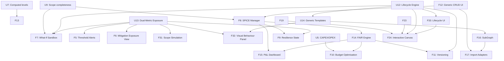

# Risk Influence Map (RIM) - Development Roadmap v3

**Optimised for Multi-Agent Execution**

**Context for Future AI Agents:**
This `ROADMAPv3.md` supersedes `ROADMAPv2.md`. It incorporates three new architectural pillars decided following a methodology review in March 2026: **Risk Lifecycle Management** (6-state lifecycle with trigger-based activation), the **Dual-Metric Exposure Model** (Expected Loss + Tail Risk Indicator + quadrant classification), and the **Generic Risk Template architecture** (template/instance pattern for combinatorial risk domains). These are not optional enhancements — they are now mandatory components of the Phase 2 deliverable and affect the exposure calculator, schema YAML, and multiple UI surfaces.

The parallel-streams philosophy is maintained. Agents must read this document fully before beginning work on any Phase 2 or later feature, as several features from ROADMAPv2 have been repositioned, renamed, or expanded.

---

## Completed Phases (Reference Only)

*   **Phase 1: Foundation, Architecture & Scope Completeness** — **COMPLETE**
    *   U1–U3, U6–U11, F1–F3, F12–F13, F18–F29, F30 are **COMPLETE**.
    *   The generic ContextNode architecture, computed levels, relationship semantics, scope completeness, schema-driven filter system, zone-aware layout, interactive scope sandbox, node property panel, loop detection, and UI performance enhancements are established.
    *   Current version: **v2.23.0**

---

## Architectural Pillars Added in v3

Before reading the work streams below, agents must understand three new mandatory architectural concepts introduced in this version.

### Pillar 1: Risk Lifecycle Management

**Motivation:** As risk programmes scale, the number of nodes on the analysis canvas becomes unmanageable. Accepted, closed, and low-exposure risks must be preserved for audit and re-activation purposes, but suppressed from the active canvas by default. The lifecycle framework is the mechanism that keeps the graph navigable at scale (target: ~100 active nodes on the canvas at any time).

**The 6-state lifecycle:**

| Status | Definition | Canvas Visibility | Exposure Calculation |
|--------|-----------|-------------------|---------------------|
| `active` | Currently tracked | Full opacity | Yes |
| `accepted` | Formal owner decision | Hidden by default | No |
| `watching` | Accepted + monitoring condition attached | Low opacity ghost | No (monitored) |
| `suppressed` | Final exposure dropped below acceptance threshold via mitigation | Very low opacity | No |
| `closed` | Risk condition no longer exists | Hidden (audit only) | No |
| `archived` | Terminal state; configurable retention period elapsed | Excluded from all queries | No |

**Trigger condition mechanism:**
- Defined as a property `trigger_condition` (string) on `accepted` and `watching` risk nodes.
- Evaluated by a lightweight trigger engine each time the exposure calculator runs.
- When a condition fires, status transitions automatically: `watching` → `active`, `suppressed` → `active`.
- Example expressions: `upstream_risk_X.final_exposure > 0.6`, `scenario_Y.activated == true`, `days_since_acceptance > 180`.

**Auto-acceptance rules:**
- Defined in the domain schema YAML under `risk_lifecycle_rules`.
- Apply only to risks in the **Frequency** or **Marginal** quadrant (see Pillar 2).
- **CRITICAL CONSTRAINT: Auto-acceptance is blocked for any risk with `impact >= severity_ceiling` (default: 7/10), regardless of final_exposure.** This protects black swans and low-probability/high-severity risks from being silently suppressed.

**Archiving:**
- Trigger: risk in `accepted` or `closed` status for > `archive_retention_days` (configurable, default: 180) with no trigger fires and no linked open mitigations.
- Surfaced as a housekeeping alert in the dashboard.
- Archived nodes are retained in Neo4j with full property history; excluded from all active queries by default.

---

### Pillar 2: Dual-Metric Exposure Model

**Motivation:** A simple L×I score produces identical results for (L=0.8, I=2) — a frequent, absorb-able disruption — and (L=0.2, I=8) — a rare but potentially catastrophic event. These require fundamentally different management responses. The dual-metric model makes this distinction explicit and computable.

**Two computed indicators (both produced by the exposure calculator):**

| Metric | Formula | Purpose |
|--------|---------|---------|
| **Expected Loss (EL)** | Base_Exposure × Effective_Factor (existing formula) | Budgeting, routine risk management, operational prioritisation |
| **Tail Risk Indicator (TRI)** | Likelihood × Impact^α  (default α = 1.5, configurable per domain in YAML) | Surfaces severity risks disproportionately; signals black swan candidates |

**Risk Quadrant Classification (computed property, not stored):**

| Quadrant | Condition (defaults) | Auto-Acceptance | Management Posture |
|----------|---------------------|-----------------|-------------------|
| `frequency` | L ≥ 6/10 AND I < 6/10 | Eligible | Manage routinely; EL drives decisions |
| `severity` | L < 6/10 AND I ≥ 7/10 | **Blocked** | Black swan territory; explicit human decision required |
| `critical` | L ≥ 6/10 AND I ≥ 6/10 | **Blocked** | Priority mitigation; both EL and TRI high |
| `marginal` | L < 6/10 AND I < 6/10 | Eligible | Monitor or accept |

**All thresholds are configurable per domain in the schema YAML** under `risk_lifecycle_rules.quadrant_thresholds`.

**UI surfaces requiring update:**
- Node Property Panel (section ② Exposure Metrics): add `TRI`, `risk_quadrant` fields.
- Dashboard: add quadrant distribution widget.
- Graph canvas: node border style encodes quadrant (optional visual layer, see F32).
- Filter system: add quadrant filter to sidebar.

---

### Pillar 3: Generic Risk Template Architecture

**Motivation:** Combinatorial risk spaces (particularly cybersecurity entry_point × technical_target) cannot be managed as individual nodes without graph explosion. The template/instance pattern contains complexity while preserving full analytical coverage.

**Data model:**

- **`GenericRisk` node** (`status: template`): Risk class definition with baseline L, I, and description. Excluded from exposure calculations and canvas display by default. Lives in Neo4j as a reference node.
- **`SpecificRisk` node** (`status: active` or other lifecycle status): Contextual instantiation. Linked to its parent template via `[:INSTANTIATES]` relationship. Inherits baseline values, overrides with context-specific calibration. Exposure engine operates only on specific instances.
- **Navigation**: from any `SpecificRisk`, analysts can navigate to the parent template to discover other potential instantiations.

**Schema YAML extension required:** Add `generic_risk_templates` block — a list of template node IDs or a flag `is_template: true` on `Risk` nodes.

**Integration with lifecycle:** A `GenericRisk` template node is never subject to lifecycle transitions. Templates persist indefinitely and are managed separately from the active risk inventory.

---

## Current Roadmap: Multi-Agent Parallel Execution

### 🌊 Work Stream A: Visual & UI Enhancements (Frontend Focused)

All Phase 1 visual features are **COMPLETE**. Remaining items:

*   **[F5] Automated Risk Threshold Alerts** _(Iteration 4)_: Visual flags when computed `final_exposure` or `TRI` exceeds predefined thresholds. Must surface both EL-based and TRI-based alerts distinctly (a risk can be within EL threshold but above TRI threshold). Must be scope-aware. Configurable thresholds per domain in schema YAML.

*   **[F6] Mitigation Exposure View (Business Focus)** _(Iteration 4)_: Dedicated view showing mitigations contributing to exposure reduction for selected Business Risks, filterable by lifecycle status. Must be scope-aware. Must show both EL and TRI delta from each mitigation.

*   **[F32] Graph Visual Behaviour Panel** _(Iteration 5)_: Dedicated settings panel consolidating all visual toggles. New options:
    - Node appearance: size strategy (flat / EL-scaled / TRI-scaled / degree-scaled); shape override per level; label verbosity.
    - Edge appearance: thickness strategy; arrow style; curvature.
    - **Lifecycle visibility controls**: opacity per status (active=1.0, watching=configurable, suppressed=configurable); toggle to show/hide accepted and archived nodes.
    - **Quadrant visual encoding**: optional border style or secondary colour overlay encoding quadrant classification.
    - Scope Sandbox visuals: out-of-scope opacity, in-scope size multiplier, border colour.
    - Presets: "Clean Presentation", "Analysis Deep-Dive", "Lifecycle Audit", "Sandbox Edit".
    - Settings persisted to `schema.yaml` under `graph_visual_config` block.
    - Supersedes: F20 (Exposure-Driven Opacity), F21 (Lifecycle Ghosting), all scatter-shot visual toggles.

---

### 🌊 Work Stream B: Schema & Context Data Management (Backend/Fullstack)

*   **[U12] Risk Lifecycle Engine** _(Iteration 4 — MANDATORY before F7)_: Core backend implementation of Pillar 1.
    - Extend `Risk` node schema with new status values: `accepted`, `watching`, `suppressed`, `closed`, `archived`.
    - Add `trigger_condition` (string), `acceptance_date`, `acceptance_owner`, `archive_date` properties to `Risk` nodes.
    - Implement `TriggerEngine` class in `services/trigger_engine.py`: evaluates trigger conditions post-exposure calculation; transitions node status; logs transitions with timestamp and reason.
    - Implement `AutoAcceptanceEngine` in `services/auto_acceptance.py`: applies domain YAML rules; enforces severity ceiling constraint (never auto-accept if `impact >= severity_ceiling`).
    - Implement `ArchiveEngine` in `services/archive_engine.py`: identifies archivable nodes; surfaces them as dashboard alerts; executes archive transitions on explicit user confirmation.
    - Add `risk_lifecycle_rules` block to domain schema YAML: `acceptance_threshold`, `severity_ceiling`, `archive_retention_days`, `quadrant_thresholds`.
    - **Testing gate**: trigger condition evaluates correctly; auto-acceptance respects severity ceiling; archived nodes excluded from all graph queries.

*   **[U13] Dual-Metric Exposure Model** _(Iteration 4 — MANDATORY)_: Core backend implementation of Pillar 2.
    - Extend `exposure_calculator.py`: after computing `final_exposure` (EL), compute `tail_risk_indicator = likelihood * impact ** alpha` where `alpha` is read from schema YAML (default 1.5).
    - Compute `risk_quadrant` classification (frequency / severity / critical / marginal) from L, I, and schema YAML thresholds.
    - Store `tri` and `risk_quadrant` as computed properties in `exposure_results` session state (not persisted to Neo4j — recomputed on each run).
    - Update Node Property Panel section ② to display `tri`, `risk_quadrant`, and both metrics side-by-side.
    - Update dashboard statistics to include quadrant distribution.
    - Update filter system: add `risk_quadrant` multiselect filter (schema-driven).
    - **Testing gate**: TRI computed correctly; quadrant boundaries match YAML thresholds; severity quadrant risks flagged correctly.

*   **[U14] Generic Risk Template Architecture** _(Iteration 5)_: Core backend implementation of Pillar 3.
    - Add `is_template: true` flag to Risk node schema (YAML-driven).
    - Implement `[:INSTANTIATES]` relationship type in schema YAML.
    - Extend CRUD UI: template creation/editing form (separate from active risk form); instantiation workflow (select template → override fields → create SpecificRisk linked via `INSTANTIATES`).
    - Exposure calculator: skip all `is_template: true` nodes.
    - Graph visualisation: template nodes rendered with distinct visual marker (dashed border) when visible; hidden from canvas by default.
    - Node Property Panel: for SpecificRisk nodes, add section showing parent template and sibling instances.
    - **Testing gate**: templates excluded from EL and TRI calculation; INSTANTIATES traversal works correctly; instantiation workflow creates correctly linked nodes.

---

### 🌊 Work Stream C: Analytical & Simulation Tools (Algorithmic)

*   **[F7] "What-If" Analysis Sandbox** _(Iteration 4)_: Toggle mitigations ON/OFF to live-preview downstream exposure changes without committing to DB. **Critical constraint**: must operate fully within the active scope. **New requirement**: What-If must compute and display both EL delta and TRI delta for each mitigation toggle — not just EL. This is essential for identifying mitigations that reduce EL but not TRI (i.e., mitigations that address frequency but not severity exposure).

*   **[F31] Scope-Driven Simulation & Results Storage** _(Iteration 4)_:
    - **F31a** Scope-based simulation mode: real DB data; real L/I/strength values; real topology.
    - **F31b** Simulation results storage: save, compare, export. `SimulationRecord` now stores both EL and TRI distributions per run, enabling severity-tail comparison across scenarios.
    - **New — F31c** Lifecycle-aware simulation: option to run simulation with all `accepted`/`watching` risks re-activated (best-case vs worst-case canvas). Surfaces latent tail exposure from currently-suppressed risks.

---

## 🗓️ Active Sprint Plan: Iterations for Next Development Cycle

### 🔁 Iteration 4 — Lifecycle, Dual-Metric & What-If _(v2.24.0 → v2.26.0)_
**Target features:** U12, U13, F7, F31a, F31b
**Streams:** B (Backend — U12/U13 first), C (Algorithmic — F7/F31 depend on U13)
**Prerequisites:** U12 must complete before F7 (lifecycle status affects Which nodes participate in What-If)

| Task | File(s) | Details |
|------|---------|---------|
| **U12** Risk Lifecycle Engine | `services/trigger_engine.py` (new), `services/auto_acceptance.py` (new), `services/archive_engine.py` (new), `schema.yaml`, `models/risk.py` | See Pillar 1 spec above. Add 4 new status values. Add trigger_condition, acceptance_date, acceptance_owner, archive_date properties. |
| **U13** Dual-Metric Exposure | `services/exposure_calculator.py`, `ui/panels/node_property_panel.py`, `ui/home.py`, `schema.yaml` | Compute TRI and risk_quadrant post-EL. Expose in panel and dashboard. Add quadrant filter. |
| **F7** What-If Sandbox | `pages/3_🔬_Analysis.py` (new or existing), `services/exposure_calculator.py` | Toggle mitigations; recompute EL + TRI in-memory; display both deltas. Scope-constrained. |
| **F31a/b** Scope Simulation | `pages/2_🎲_Simulation.py`, `utils/simulation_store.py` (new) | Real-data mode; SimulationRecord stores EL+TRI distributions; export to Excel. |

**Testing scope:** Lifecycle transitions fire correctly. Auto-acceptance blocks severity-ceiling risks. TRI and quadrant computed correctly. What-If shows EL+TRI deltas. Simulation stores and compares results.

---

### 🔁 Iteration 5 — Templates, Alerts & Visual Behaviour _(v2.27.0 → v2.29.0)_
**Target features:** U14, F5, F6, F32
**Streams:** B (U14), A (F5, F6, F32)
**Prerequisites:** U13 complete (F5/F6 consume TRI; F32 encodes quadrant)

| Task | File(s) | Details |
|------|---------|---------|
| **U14** Generic Risk Templates | `models/risk.py`, `schema.yaml`, `ui/tabs/unified_crud_tab.py`, `services/exposure_calculator.py`, `ui/panels/node_property_panel.py` | Template flag, INSTANTIATES relationship, template CRUD, instantiation workflow, template exclusion from exposure engine. |
| **F5** Threshold Alerts | `ui/home.py`, `schema.yaml` | EL-based and TRI-based alert flags, distinct visual treatment, configurable thresholds. |
| **F6** Mitigation Exposure View | `ui/tabs/analysis_tab.py` or `pages/3_🔬_Analysis.py` | Business Risk mitigation view; lifecycle filter; EL+TRI delta per mitigation. |
| **F32** Graph Visual Behaviour Panel | `ui/panels/graph_visual_panel.py` (new), `schema.yaml` | Consolidated visual settings; lifecycle opacity controls; quadrant encoding; presets; persisted to schema YAML. |

**Testing scope:** Templates excluded from all calculations. Instantiation creates correctly linked nodes. Alerts fire on EL and TRI thresholds independently. Visual panel presets apply correctly.

---

## Future Horizons

### 🌊 Work Stream D: SPICE Scenarios & Financial Anchoring (Depends on B completion)

*   **[F8] SPICE Scenario Manager**: Full UI for ContextNode-based scenario create/edit/link. Scenarios must also be linkable to `watching` risk nodes to serve as activation triggers (`scenario_Y.activated == true`).
*   **[F9] Resilience State Modeling**: Classify into Robust/Resilient/Fragile based on SPICE exposure vs thresholds. **New requirement**: state model must incorporate TRI alongside EL — a portfolio dominated by Severity-quadrant risks may be RESILIENT on EL grounds while carrying latent FRAGILE exposure visible only through TRI.
*   **[F15] P&L Exposure Dashboard**: Aggregate EBIT-at-risk and FCF-at-risk per `business_perimeter` context node.

### 🌊 Work Stream E: FAIR Financials (Depends on D & C)

*   **[F14] FAIR Financial Quantification — SPICE-Calibrated**: ALE engine using TEF from SPICE, LM from SPICE impact ranges, Vulnerability from existing mitigation engine (V = 1 − Effective_Mitigation_Factor).
*   **[F10] Mitigation Budget Management**: CAPEX/OPEX-constrained optimisation (Depends on U5) using FAIR ALE as objective function.

### 🌊 Work Stream F: Advanced Architecture

*   **[F16] SubGraph Promotion and System of Systems**: Promote `AnalysisScopeConfig` to `SubGraphConfig` with hierarchy and policies (isolated / permeable / transparent). **Note**: Generic Risk Templates defined at SubGraph level should be inheritable by child SubGraphs — design the inheritance model during F16.
*   **[F17] External Graph Ingestion (Import Adapters)**: YAML-defined adapters mapping external node/edge types to ContextNode types (e.g., IT architecture, Supply Chain, STIX threat intelligence). Imported nodes always land as Context Nodes; imported edges always semantic:context — they never participate in exposure propagation until a risk node is manually linked.
*   **[F11] Historical Timeline / Versioning**: Render graph state "as it was" at any previous date. **Note**: lifecycle status transitions must be versioned — the timeline must be able to show when risks were accepted, triggered back to active, suppressed, and archived.

### 🌊 Work Stream G: Advanced Graphical Interaction (BIG Features)

*   **[F24] Interactive Canvas Editing**: Direct graphical manipulation of nodes and edges on the canvas. Must respect lifecycle status — archived and closed nodes cannot be reactivated by canvas drag; only through the lifecycle management UI.
*   **[F33] Lifecycle Management UI** _(new)_: Dedicated page or modal for lifecycle operations — bulk accept, bulk archive, trigger condition editor, lifecycle history timeline per risk node. Provides the formal workflow for risk owners to process acceptance decisions with audit trail.

---

## Open Questions — Multi-Agent Coordination

**Q1 — Cross-Stream Dependency Management**
When an agent in Stream A requires backend modifications (e.g., a new field added by Stream B) to complete a UI task, what is the protocol for pausing and handing over the task without causing a merge conflict or logic fragmentation?

**Q2 — Agent Testing Sandboxes**
Are there dedicated, isolated database instances or namespaces for agents to run the mandatory Testing Gateways without overwriting each other's test data during parallel execution?

**Q3 — Schema Context Limits**
As the YAML schema grows to accommodate risk_lifecycle_rules, TRI alpha, quadrant_thresholds, and template configurations, how will AI agents maintain the full schema in their context window efficiently?

**Q4 — Dynamic Tracking of Computational Node Types**
Currently, `BusinessRisk` and `OperationalRisk` are the only node types carrying mathematical weight. Generic Risk Templates (`is_template: true`) must be explicitly excluded. Should the YAML schema include a `computational: true` flag (default: true for Risk nodes, false for template nodes) to make this exclusion declarative rather than hardcoded?

**Q5 — Trigger Condition Security**
Trigger condition expressions are stored as strings in Neo4j and evaluated at runtime. What is the appropriate sandboxing approach to prevent injection or infinite-loop conditions in the trigger engine? Consider a restricted expression DSL rather than arbitrary Python eval.

**Q6 — TRI Alpha Calibration**
The default α = 1.5 for TRI has not been validated against real programme data. The Monte Carlo simulation (F31) should include a TRI calibration mode — varying α and observing the resulting quadrant distribution — to help practitioners choose domain-appropriate values. This should be added as a sub-task of F31c.

---

## Feature Dependency Map



---

## Schema YAML Extensions Required (Summary)

The following blocks must be added to the domain schema YAML as part of Iterations 4–5. They are documented here as a reference for agents working on U12, U13, and U14.

```yaml
# Lifecycle rules (U12)
risk_lifecycle_rules:
  acceptance_threshold: 20          # final_exposure below which auto-acceptance is eligible
  severity_ceiling: 7               # impact >= this value blocks all auto-acceptance
  archive_retention_days: 180       # days in accepted/closed before archiving alert fires
  quadrant_thresholds:              # (U13)
    likelihood_threshold: 6         # L >= this → high likelihood
    impact_threshold_frequency: 6   # I < this (with high L) → frequency quadrant
    impact_threshold_severity: 7    # I >= this (with low L) → severity quadrant

# TRI configuration (U13)
exposure_model:
  tri_alpha: 1.5                    # exponent for Tail Risk Indicator; calibrate per domain

# Graph visual defaults (F32)
graph_visual_config:
  lifecycle_opacity:
    watching: 0.35
    suppressed: 0.15
  quadrant_border_encoding: true    # show quadrant as border style on nodes
  default_preset: "analysis"        # clean | analysis | lifecycle_audit | sandbox
```
